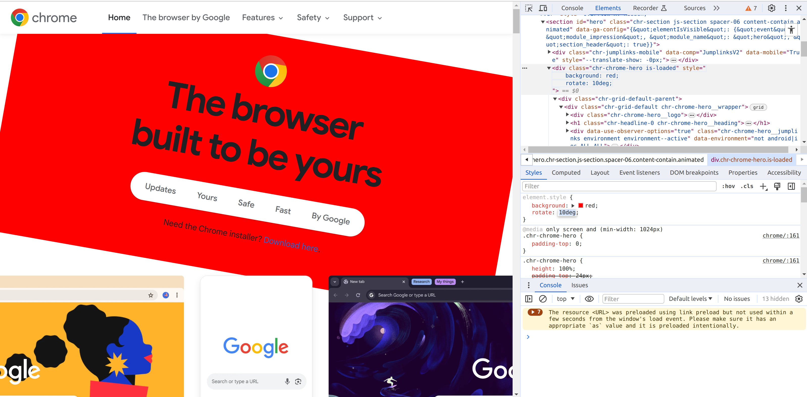

# Lab 1: Getting started

In this lab session we introduce the three software tools that will be used in this module.

- [Google Chrome](https://www.google.com/intl/en_uk/chrome/) (web browser)
- [VSCode](https://code.visualstudio.com/) (text editor)
- [GIT](http://git-scm.com/) (version control system)

If you need to, use the links above to install the software.

## Google Chrome and the developer tools

Open Google Chrome and visit the [Google Chrome](https://www.google.com/intl/en_uk/chrome/) website.

> You may want to set google chrome as your default browser for the duration of this module

Scroll down the page and notice the structure.
There is a menu at the top, followed by a series of distinct sections and a footer at the bottom of the page.

Press `F12` to open the developer tools panel in Chrome.
Alternatively, in the Chrome menu, select `more tools` and `developer tools`.

Under the `Elements` tab, within the developer tools panel you should find a nested structure containing all the elements of the page.
This is a developers representation of the `Document Object Model`.

Try to find elements within the nested structure that correspond to the visible parts of the page.
Notice that when elements are selected in the developer tools, they are highlighted on the page.
Also notice that the style rules of the selected element are also provided.

### Edit the DOM

Choose an element in the page, something fairly large.
For example, this one.

 ```HTML
<div class="chr-chrome-hero is-loaded">
```

With the element selected in the `Elements` tab, look at the `Styles` panel below.

> It can be tricky to find the elements and navigate to the correct place in the developer tools. 
If you struggle with this, ask your lab tutor to help.


At the top of the panel, there should be something like this:

```CSS
element.style {
}
```

Click into this code and add the following:

```CSS
element.style {
    background: red;
}
```

You should see the element background becomes red.

Now add the following:

```CSS
element.style {
    background: red;
    rotate: 10deg;
}
```

If you managed to edit the CSS rules correctly, you should see that the entire element has been rotated.




Explore the site, understand how it is structured and ask questions if you have them.

## VSCode text editor

Now we are going to create our first project.

Create a folder where you will store all the code for CTEC3905 and *within* that folder, create a folder called **lab-work**.

This folder will become a git repository eventually containing all the work from the lab sessions.

Open VSCode and select `File -> Open Folder` and select your **lab-work** folder.
This should open a panel on the left side showing your empty folder.

Its best to keep the code for each lab session separate.
Use VSCode to create another folder called **lab-01** within the **lab-work** folder for today's work.

> There is an icon you can use for creating a folder, or you can right-click on the explorer panel and choose the `New Folder...` option.

### Create an HTML document

Create a blank file called **index.html** and be sure to save it.
Once saved, the editor will activate auto-complete snippets for HTML.
Now use your existing knowledge to create a simple page with some visible content.
You can refer to [the module slides](https://ctec3905-2020-21.github.io/splash/?file=html.md&slide=3) or [this simple tutorial](https://www.w3schools.com/html/html5_intro.asp) for guidance.

Make sure your code is properly indented.
If you have a question about this, ask it.
Its very important to develop good habits from the beginning.
Good indentation throughout your assignment code is worth 5% of the mark.
A single mistake will cost you 2.5%, multiple mistakes will cost you 5%.

Load the page into Google Chrome by opening the file in your file manager.
Alternatively, with the file open in VSCode, click and drag the tab at the top of the file and drop it as a new tab in Chrome (i.e. drop onto the tab container at the top of the Chrome window).

Play around a bit.
Make some changes and see how they affect your page.
Use `ctrl-R` in Chrome to reload the page in your browser each time you make a change.

Check your code in the [HTML validator](https://validator.w3.org/) and correct any errors (repeat by validating each time you add more code).

### Add some CSS styles

Create a **styles.css** file and link it in your HTML file by adding this line in the HTML head section:

```html
<link rel="stylesheet" href="styles.css">
```

Add the following line to your **styles.css** file:

```css
body { background: yellow; }
```

Reload the page in Chrome.
Try some more styles in your **styles.css** file, reloading the page each time.

## Add some javascript

Create a **scripts.js** file and link to it in your HTML file just before the closing `</body>` tag like this:

```html
<script src="scripts.js"></script>
```

Add the following to your **scripts.js** file:

```js
alert("Hello!");
```

Reload the page in the browser.

If the above works, *change* it to:

```js
console.log("Hello!");
```

Reload the page, open the developer tools and check the `Console` panel (it should say “Hello!”).

Add an element with an `id="myElement"` attribute into the `<body>` element in your HTML.

> It's fine if you have more than this in your `<body>` element.

```html
<body>
    <p id="myElement">
        I'm a paragraph
    </p>
    <script src="scripts.js"></script>
</body>
```

Type the following into the JavaScript console.

```js
myElement
```

You should see that you have access to the element directly.
Try this:

```js
myElement.textContent = "I've changed the content!";
```

You should see that the page has been updated.

> Refreshing the page reloads the original content.

## CSS classes

Add the following to your **styles.css** file:

```css
.my-class {
    background-color: red;
    color: yellow;
}
```

Now, in the `<body>` of your HTML file, add an element with the attribute `class="my-class`.

> Again, it's fine if you have more than this in your `<body>` element.

```html
<body>
    <p id="myElement">
        I'm a paragraph
    </p>
    <p class="my-class">
        I'm a different class of paragraph.
    </p>
    <script src="scripts.js"></script>
</body>
```

> Take note that we used cammelCase for the `id` attribute because it was used in JavaScript but we hyphenated the `class` attribute because it was used in CSS.
> Following these conventions is easy if you get into the correct habits.

## Git version control

Now we are going to create a git repository from our code.
Git allows us to make incremental improvements to our code whilst also allowing free experimentation.

Open the git command line.
If you are on Windows, use the `git bash` console.

> On mac or linux, a regular terminal will do

Change the current directory to your **lab-work** folder:

```bash
cd path/to/your/CTEC3905/lab-work
```

Make sure you are now in the correct location and convert your folder into a git repository.

```bash
git init
```

Check the situation, you should see three untracked files.

```bash
git status
```

Make sure you **always** check your code with the [HTML validator](https://validator.w3.org/) before committing.
Try not to commit invalid code to your repository.

> This is important, never commit anything invalid or broken to your project

Before committing, git requires that we place changes into a *staging area* also known as *the index*.

Add the whole project into the staging area.

```bash
git add .
```

The last dot is important, it refers to the current folder.

Finally, commit your work to the repository with a simple message.

```bash
git commit -m "lab-01: a basic HTML template with some styles and JavaScript"
```

Now, make some changes to your project and repeat the steps with a new commit message.

Continue making tweaks to your page until you are satisfied.

## Conclusion

We have explored the basic workflow which we will use in this module and which you will need to use for your assignment.

- Using VSCode to write HTML, CSS and JavaScript code
- Viewing your document in Google Chrome
- Using the developer tools to view the DOM
- Using the JavaScript console 
- Validating your code with online validators
- Committing your updates to a git repository

If you don't have one, you will need to set up a [GitHub](https://www.github.com) account.