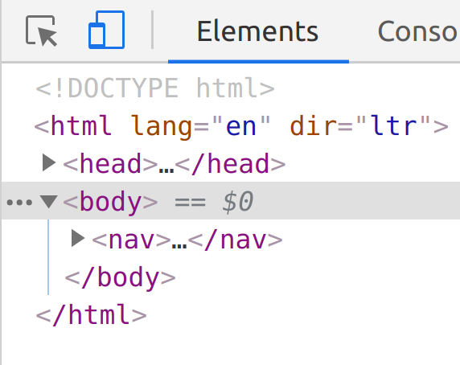

# Exercise 04-lab: A responsive menu

This week we will create a responsive menu.
We will be using **media queries** to change our layout at different viewport widths.
To help us, we will need to use the browser developer tools to see how our site appears on different devices.

## Set up

Create a folder **lab-04** for this week's code and open the folder in atom.
Create a standard **index.html** file and link it to a **styles.css** file.
In the `head` element, add the following `meta` tag.

```html
<meta name="viewport" content="width=device-width, initial-scale=1.0">
```

This will enable mobile browsers to recognise that your site is optimised for all devices.

The browser developer tools panel allows you to control the size of your viewport.
You can do this by either increasing the width of the panel or you can activate the [*device toolbar*](https://developers.google.com/web/tools/chrome-devtools/device-mode/#viewport) by clicking on the icon or using `ctrl+shift+m`.


<figcaption style="text-align: center; margin-bottom: 1em">The Chrome device toolbar icon highlighted in blue</figcaption>

Shrink your viewport to about 400px wide.
We will begin developing for a mobile device.

## Create a basic mobile menu

Add the following `nav#menu` element into your HTML `body` element.

```html
<nav id="menu">
  <a href="#">Home</a>
  <a href="#">Blog</a>
  <a href="#">Gallery</a>
  <a href="#">Contact</a>
  <a href="#">About</a>
</nav>
```

Note that we are identifying the element so we can manipulate it with JavaScript.

This time, we will style it to appear vertically at the top of the page.
Include the following to make the `nav` layout vertically with flexbox.

```css
nav {
  display: flex;
  flex-direction: column;
}
```

Adjust the colours and box-model properties as necessary to make the links appear how you want them (see lab-02).

Now add a new `div` element **before** the `nav` element.
This will be a button we can use to "open" and "close" the mobile `nav`.
Inside your `div` add the uncode character for *identical to* (`&#8801;`).

```html
<div id="menuToggler">&#8801;</div>
```

The `div` has an `id` attribute of `menuToggler`.
This is also so we can identify it in JavaScript.

Style your `#menuToggler` element so it appears in keeping with the rest of your menu.

Both your links and the `#menuToggle` element should be large enough for a finger.
Make sure you set an appropriate `font-size` and use enough `padding` so they can be accessed individually.

Add a few `paragraphs` of `lorem ipsum` text after the `nav` element.

Your HTML should look like this.

```html

<!DOCTYPE html>
<html lang="en" dir="ltr">
  <head>
    <meta charset="utf-8">
    <title>Responsive menu</title>
    <meta name="viewport" content="width=device-width, initial-scale=1.0">
    <link rel="stylesheet" href="styles.css">
  </head>
  <body>
    <div id="menuToggler">&#8801;</div>
    <nav id="menu">
      <a href="#">Link 1</a>
      <a href="#">Link 2</a>
      <a href="#">Link 3</a>
      <a href="#">Link 4</a>
      <a href="#">Link 5</a>
    </nav>
    <p>Lorem ipsum dolor sit amet, consectetur adipisicing elit, sed do eiusmod tempor incididunt ut labore et dolore magna aliqua. Ut enim ad minim veniam, quis nostrud exercitation ullamco laboris nisi ut aliquip ex ea commodo consequat. Duis aute irure dolor in reprehenderit in voluptate velit esse cillum dolore eu fugiat nulla pariatur. Excepteur sint occaecat cupidatat non proident, sunt in culpa qui officia deserunt mollit anim id est laborum.</p>
    <p>Lorem ipsum dolor sit amet, consectetur adipisicing elit, sed do eiusmod tempor incididunt ut labore et dolore magna aliqua. Ut enim ad minim veniam, quis nostrud exercitation ullamco laboris nisi ut aliquip ex ea commodo consequat. Duis aute irure dolor in reprehenderit in voluptate velit esse cillum dolore eu fugiat nulla pariatur. Excepteur sint occaecat cupidatat non proident, sunt in culpa qui officia deserunt mollit anim id est laborum.</p>
    <p>Lorem ipsum dolor sit amet, consectetur adipisicing elit, sed do eiusmod tempor incididunt ut labore et dolore magna aliqua. Ut enim ad minim veniam, quis nostrud exercitation ullamco laboris nisi ut aliquip ex ea commodo consequat. Duis aute irure dolor in reprehenderit in voluptate velit esse cillum dolore eu fugiat nulla pariatur. Excepteur sint occaecat cupidatat non proident, sunt in culpa qui officia deserunt mollit anim id est laborum.</p>
  </body>
</html>

```

## Activate the menu with JavaScript

We will begin by adding some JavaScript to toggle the menu visibility.
We want the `nav` element to be hidden by default and use the click event of the `#menuToggler` element to add and remove an `open` class which we will use to style our menu accordingly.

Add a `script` element to the end of the `body`  (as the last child within the `body` element) with the attribute `src="scripts.js"`.

Create the file `scripts.js` and add the following.

```js
menuToggler.addEventListener('click', ev => {
  menu.classList.toggle('open');
});
```

Now you should see that clicking on the `#menuToggler` element toggles the `open` class as expected.

> If you don't see this behaviour in the **elements** panel of the developer tools then check that your script is loading with a simple `console.log("testing")` statement at the top of the file.
If you see the logged message, then the problem is with your JavaScript.
If not then your script isn't loading and you may have a problem with your `script` tag or the file name/location.

Once you are happy that the code is working replace the `display:flex` rule on the `nav` element with `display: none` so it is **hidden by default**.
Your menu should disappear.

Add the following ruleset to your css under the `nav` ruleset.

```css
nav.open {
  display: flex;
}
```

This will return the `nav` to being visible when the `open` class is toggled by our JavaScript.
Try it out.

Admire your well-crafted JavaScript interaction.

## Make the menu responsive

So now we have a working mobile menu but if you expand the width of your viewport to become wider then there is eventually enough room for the menu to comfortably fit at the top of the page as in lab-02.

We will now insert some additional styles to make the site display the menu at the top when the screen width is above a given breakpoint.

Add a **media query** into your CSS file as follows.

```css
@media screen and (min-width: 500px) {

  #menuToggler {
    display: none;
  }

  nav {
    display: flex;
    flex-direction: row;
  }

}
```

The above code will only apply to devices with screens `500px` wide or more.
On these larger devices, the `#menuToggler` will not be needed because the `nav` itself will be displayed no matter whether it has the `open` class.
Also, we have changed the `flex-direction` to `row` so the menu items are displayed horizontally.

Try changing the viewport width to above and below `500px`.
Adjust the media query `min-width` value until the horizontal menu is applied as soon as there is room on the page (i.e. change the `500px` value to equal the minimum width of the horizontal menu).


## Animating the mobile menu

In the example above we switched the `display` property from `flex` to `none` when the `open` class was toggled.
We would like to animate the `nav` with a `transition` but unfortunately, we can't use a `transition` on the `display` property.

An alternative is to use something like `opacity` or `transform` which can be animated.
These properties are perfect for applying a `transition` which will animate the element between the default state and the state when the `open` class is applied.

We will start with `opacity`.
Set the `nav` element to be `opacity: 0` by default and `opacity: 1` when the `open` class is applied.

> remember to replace the `display: none` with `display: flex` on the `nav` ruleset and remove the `display: flex` from the `nav.open` ruleset.

Add `transition: 0.5s` onto the `nav` ruleset

Notice a problem?
The menu is invisible but it still takes up space in the normal flow of the document.
The same problem occurs with `transform`.
Set the menu to be `transform: translateX(100vw)` by default and `transform: translateX(0)` when the `open` class is applied.

Whichever approach we take, we will need to remove the `nav` element from the flow.
This requires careful design.
Where should the `nav` be located?

One approach is to set the `nav` and the `#menuToggler` elements to have `position: fixed`.
This will take them out of the flow and allow us to position them relative to the viewport edges.

Try this:

```css
nav {
  display: flex;
  flex-direction: column;

  /* more custom styles */

  position: fixed;
  width: 100%;
  top: 0;
  transform: translateX(100vh);
  transition: 0.5s;
}

nav.open {
  transform: translateX(0);
}

#menuToggler {
  position: fixed;
  top: 0;
  right: 0;
  z-index: 1;
  /* more custom styles */
}

```

This should result in your `#menuToggler` shrinking into the corner.
Notice that it remains in the same spot no matter where you scroll.
When activated, the menu itself behaves similarly.

When positioning elements in this way, we need to set their location relative to the viewport so we place both elements at `top: 0` which lines them up with the top of the screen.

Also notice that `z-index: 1` on the `#menuToggler` ensures that the element is clickable when the menu is visible.
Without this, the menu sits in front of the `#menuToggler` and cannot be dismissed.

The menu itself is set to `width: 100vw` to ensure it spans the whole viewport.

You may want to experiment with `height: 100vh` also which can work well with setting `flex-grow: 1` on the `nav a` elements depending on your design.
Also, transparent `background-color` values (e.g. `rgba(0,0,0,0.5)`) on the `nav` and/or `nav a` will show that the site still scrolls behind the menu.

## Fix the (min-width) styles

Now expand your site above the break point and see that the new styles have broken everything.

Fix it by setting the `nav` to `position: static` and `transform: translateX(0)` within the media query.
If you set the `nav` element height then you will also need to return it to `auto`.

## Experiment with `transform`

The [`transform`](https://developer.mozilla.org/en-US/docs/Web/CSS/transform) property is really useful for manipulating the position, shape and/or size of an element.
In this case, we use `transform: translateX(100vw)` to locate the menu off the side of the viewport and to have it animate back into the viewport when the menu is `open`.

Setting `transform: translateX(100vw)` moves an element `100vw` (i.e. a full screen width) in the x-axis direction (i,e, to the right).
Using `transform: translateX(-100vw)` would move it to the left.

Read about the [`transform`](https://developer.mozilla.org/en-US/docs/Web/CSS/transform) property and do some experiments.

## A more detailed example

Look at the example code from this weeks video on responsive design.

See how the `#menuToggler` element itself is constructed from three `div` elements and animated using the `transform` property.

## Learning outcomes

- Using CSS to style a mobile menu
- Adding and removing a class with JavaScript
- Understand how `min-width` **media queries** contain styles that are activated at specified breakpoints
- Using CSS `transform` and `transition` to animate elements
- Using CSS `position: fixed` to position elements relative to the viewport

## Links and resources

- [CSS selectors (MDN)](https://developer.mozilla.org/en-US/docs/Web/CSS/CSS_Selectors)
- [JS ES6 arrow functions (basic syntax)](https://developer.mozilla.org/en-US/docs/Web/JavaScript/Reference/Functions/Arrow_functions#Basic_Syntax)
- [JS classList: see “Examples” for “toggle” (MDN)](https://developer.mozilla.org/en-US/docs/Web/API/Element/classList)
- [cssreference.io](https://cssreference.io/)
- [CSS transform property](https://developer.mozilla.org/en-US/docs/Web/CSS/transform)
