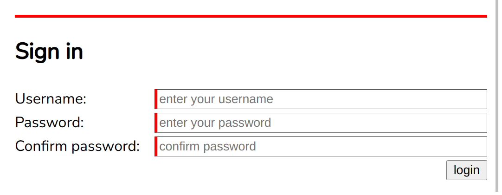

# Lab 5: Working with user input

User input is handled mostly by the `<form>` and `<input>` elements.
In this lab, we will explore how these work and build a few basic user interfaces.

## Set up a basic document

Create a standard document template, include a link to a css file and a [viewport meta tag](https://developer.mozilla.org/en-US/docs/Web/HTML/Viewport_meta_tag#viewport_basics) in the `<head>` element.
Add a script as the last element within the `<body>` element.

Insert an `<input>` element into your `<body>` element.
Notice how it appears in your page, this is not a very clear user interface.
Add a `<span>` element before your `<input>` and add the text "enter your name: " to indicate to the user what to do.


<figcaption style="text-align: center; margin-bottom: 1em">A standard way to get user input</figcaption>


## Accessibility

Well done, but we have a problem.
For users with screen readers, there is no connection between the text and the input.
This is valid code but its [not accessible](https://webaim.org/techniques/forms/controls) and so would lose marks if submitted in your assignment.

### Label elements

Instead we should use a `<label>` element and connect it to the `<input>` using a `for` attribute.

```html
<label for="myName">Enter your name</label>
<input id="myName">
```


<figcaption style="text-align: center; margin-bottom: 1em">This looks the same but is accessible to screen readers</figcaption>

### Document structure

Its also important to have heading structure (`<h1>` - `<h6>`) and basic page regions such as `<header>`, `<nav>`, `<main>`, `<footer>` and `<aside>` elements.
Every accessible document should use some of these elements to provide structure.

Add a `<header>` and a `<main>` element to begin the structure of your site.
Give your site a visible title using main heading `<h1>` element within the `<header>`.

### The aria-label attribute

An alternative to a `<label>` element is to use the `aria-label` attribute on the `<input>` element.

Add the following search tool into your `<header>`.

```html
<input id="myQuery" placeholder="search term" aria-label="search">
<button id="searchButton">search</button>
```

Your site should look a bit like this.
I've added a `<section>` around each example to keep them isolated and, of course, each section will have an `<h2>`.
This all helps with accessibility.

Notice, I've also added a unicode magnifying glass into the search input placeholder.

```html
<!DOCTYPE html>
<html lang="en" dir="ltr">
  <head>
    <meta charset="utf-8">
    <title>Lab-05</title>
    <meta name="viewport" content="width=device-width, initial-scale=1">
    <link rel="stylesheet" href="styles.css">
  </head>
  <body>
    <header>
      <section id="search">
        <input placeholder="&#128269; search" id="myQuery" aria-label="search">
        <button id="searchButton">search</button>
      </section>
      <h1>User Input</h1>
    </header>
    <main>
      <section>
        <h2>Basic input</h2>
        <label for="myName">Enter your name</label>
        <input id="myName">
      </section>
    </main>
  </body>
</html>
```

> *Remember*: For accessibility, **always** add a `<label>` element or an `aria-label` attribute to `<input>` elements.

## Some style


Add the following simple styles to your page.
Notice the imported font, simple `media` queries and use of `hsl` colors.

```css
@import url('https://fonts.googleapis.com/css2?family=Nunito&display=swap');

body {
  margin: 0;
  font-family: "Nunito", sans-serif;
}

header {
  padding: 0.5em 1em;
  display: flex;
  flex-direction: column;
  justify-content: space-between;
  align-items: center;
  background-color: hsl(0, 70%, 40%);
  color: hsl(0, 70%, 80%);
}

#search {
  order: 1;
}

main section {
  padding: 1em;
  border-bottom: 0.5px dotted hsl(0, 70%, 80%);
}

@media screen and (min-width: 420px) {
  header {
    flex-direction: row;
  }
}

@media screen and (min-width: 1000px) {
  header, main section {
    padding: 1em 200px;
  }
}

```


<figcaption style="text-align: center; margin-bottom: 1em">Inputs can be styled nicely</figcaption>

## More input types

By default`<input>` elements are generic text fields but they can be modified with the `type` attribute.

Add `type="search"` to your search input and see what difference it makes.
You should see some minor changes to the field.
When text is entered, it can be cleared with a click.

There are many [input field types](https://developer.mozilla.org/en-US/docs/Web/HTML/Element/input) available.
Some of these were introduced with HTML5:

- color
- date
- email
- number
- range
- search
- tel
- time
- url

Setting the `type` attribute of an `<input>` element to any of the above values will produce a different type of input field.

Here are some examples of the syntax:

```html
<input>
<input type="color">
<input type="date">
```

The `<input>` element is one of the most powerful and complex elements in HTML.
Some input field types have a default value, others don't.
Some require certain attributes, others don't.
We won't cover everything in this module, please do your own research.

For most input types, setting the `value` attribute will initialise the input field with data.

```html
<input value="default value">
<input type="color" value="#ff0000">
<input type="date" value="2021-01-01">
```

Some input types will only accept **specific input** so are good for preventing user errors.

### Numbers

Add a new `<section>` with a second level heading "Numbers" and an input with the type `number`.

```html
<section>
  <h2>Numbers</h2>
  <label for="myAge">Enter your age: </label>
  <input id="myAge" type="number">
</section>
```

Notice that the input will not accept non-numeric input.
It can be controlled via the keyboard arrow keys and with the mouse.

But, nobody is 10,000 years old.
What if we need to restrict it to a (generous) maximum value of 150?

Easy! Just add a `max` attribute.
Set the `max` attribute to "150".
Notice that is doesn't prevent you from entering a larger number directly, but it does prevent using the arrow keys or mouse controls to increase the value beyond the provided maximum.

A value greater than 150 also sets the pseudo-class `:invalid` which we can target with a css ruleset.
Add the following t your CSS:

```css
input:invalid {
  background-color: hsl(0, 70%, 70%);
  border-color: hsl(0, 100%, 70%)
}
```

Now notice that an invalid value will trigger the styles.

Experiment by setting the `min` and `step` attributes also.
Notice that values are invalid if they fall between steps.


<figcaption style="text-align: center; margin-bottom: 1em">Invalid number input</figcaption>

### Ranges

Inputs of type `range` provide a graphical input element that behaves similarly to the `number` type.

Add a new `<section>` with a second level heading "Ranges" and an input with the type `range`.

```html
<section class="relative">
  <h2>Ranges</h2>
  <label for="myHeight">Element height: </label>
  <input id="myHeight" type="range" value="50">
  <div id="heightTarget"></div>
</section>
```

We will use the default `min` and `max` values (0-100) to control the height of an element in `%` units.
Notice we have initialised the value of the `<input>` to "50", we also added a `class` on the `<section>` so we can style it and we have an extra `<div>` element which will be controlled via JavaScript.

Add the following additional styles.

First, at the top of your css file, add a [css custom property](https://developer.mozilla.org/en-US/docs/Web/CSS/--*) called `--height` to the `:root` element.
This is essentially a css variable and can be easily set using JavaScript.
We can name custom properties however we like.
Adding a property to the `:root` element allows us to use it throughout our css rules.

```css
:root {
  --height: 50%;
}
```

Then, add a `position: relative` to the new class.
This will act as a container for any children positioned absolutely.

```css
.relative {
  position: relative;
}
```

Now we can style the `#heightTarget` element to be `position: absolute`.
The `bottom` and `right` properties will fix its position within the relatively positioned parent element.
We also give it some width and set its `height` property to be equal to our customised `--height` property using `var(--height)`.

```css
#heightTarget {
  position: absolute;
  bottom: 0;
  right: 0;
  width: 4em;
  background-color: hsl(0, 70%, 40%);
  height: var(--height);
  transition: 0.4s;
}
```

This setup will allow us to vary the height by setting the value of the custom property.
We will do this with a simple event listener on the `input` event of our `<input>` element.
The `input` event fires whenever the value is updated.

```js
"use strict";

myHeight.addEventListener('input', ev => {
  document.documentElement.style.setProperty('--height', `${myHeight.value}%`);
});
```

Here `document.documentElement` refers to the top level element (`:root` in css terms) and `style.setProperty` allows us to set the value of any custom property.
We pass in the name of the property and the value we wish to assign.
In this case, the value is the `value` of the `myHeight` element plus a `%` symbol.

Notice that now, when the slider is adjusted, the height of the `<div>` element responds.
We have a `transition` on the element so the change is animated.

Try setting the `step` attribute of the `<input>` to a large value such as "25".
Every time the `<input>` element steps to the next value, the `input` event is triggered, our custom `--height` property is updated which changes the `<div>` css `height` property and the `transition` property animates the change.

### Colours

The colour `<input>` works exactly the same.
In the following example, notice how the code is almost identical to the avove example.

First, we add some new css custom properties for foreground colour and background colour.

```css
:root {
  --height: 50%;
  --bg-colour: #ffffff;
  --fg-colour: #000000;
}
```

Then create styles for a new `#colours` element which use the custom properties.

```css
#colours {
  background-color: var(--bg-colour);
  color: var(--fg-colour);
}
```

Now, add a new `<section>` into your document.

```html
<section id="colours">
  <h2>Colours</h2>
  <label for="myBG">Background: </label>
  <input id="myBG" type="color" value="#ffffff"><br>
  <label for="myFG">Foreground: </label>
  <input id="myFG" type="color" value="#000000">
</section>
```

Notice the use of a <br> tag to aid with formatting.

Finally, add the necessary JavaScript event listeners to activate the `<input>` elements.

```js
myBG.addEventListener('input', ev => {
  document.documentElement.style.setProperty('--bg-colour', myBG.value);
});
myFG.addEventListener('input', ev => {
  document.documentElement.style.setProperty('--fg-colour', myFG.value);
});

```

## Using forms

Create a simple login form as follows.

```html
<section>
  <form id="login">
    <h2>Sign in</h2>
    <label for="myUser">Username: </label>
    <input id="myUser" name="username" placeholder="enter your username" required>
    <label for="myPassword">Password: </label>
    <input id="myPassword" type="password" name="password" placeholder="enter your password" minlength="8" required>
    <label for="myConfirmation">Confirm password: </label>
    <input id="myConfirmation" type="password" placeholder="confirm password" required>
    <input type="submit" value="login">
  </form>
</section>
```

### Using grid layout

As a basic example of grid layout we will use `display: grid` to format the form.
This particular approach requires that all elements (except `<h2>` and inputs with `type="submit"` elements) come as `<label>`, `<input>` pairs.

```css
form {
 display: grid;
 grid-row-gap: 0.25em;
 grid-column-gap: 1em;
 grid-template-columns: minmax(max-content, 1fr) 3fr;
}

form h2 {
 grid-column: 1 / 3;
}
form input[type="submit"] {
 grid-column: 2 / 3;
 justify-self: end;
}
```

Try to understand what is going on.
The grid has two columns, one is `minmax(max-content, 1fr)` and the other in `3fr`.
This ensures the first column never wraps the "confirm password" label and the grid generally gives the second column more space.
We also customised the placing of the `<h2>` to span both columns and the `type="submit"` `<input>` to align right within the second column.
For more information about grid layouts see Jen Simmons' [Layout land](https://www.youtube.com/channel/UC7TizprGknbDalbHplROtag) youTube channel.

### Validation styles

Notice that our input elements are invalid (because they are `required`) and are styled pretty badly.

Update the `:invalid` styles like this.

```css
form input:invalid {
 border-width: 0.5px 0.5px 0.5px 3px;
 border-left-style: solid;
 border-left-color: red;
}
form input:valid {
 border-width: 0.5px 0.5px 0.5px 3px;
 border-left-style: solid;
 border-left-color: green;
}
form:invalid {
 border-top: 3px solid red;
}
form:valid {
 border-top: 3px solid green;
}
```

Now the form gently suggests more work is needed and the individual elements indicate where the problem is.


<figcaption style="text-align: center; margin-bottom: 1em">A styled form</figcaption>

### Submit behaviour

Try clicking the login button.
You should get an error message.

Fill in a username and click again.
You should get another error message.

Try a short password, less than eight characters.
You should get a different error message.

The form knows what is required and won't allow the submit action before the basic criteria are met.

### Custom validation

Using JavaScript, we can add extra validation criteria.
Currently, the form will submit even if the password confirmation field doesn't match the password field.
This is not OK.

We need custom logic to do the test.
We can use the `setCustomValidity` method on the confirmation field  to set the field to be invalid.

```js
const checkConfirmation = ev => {
 if (myPassword.value != myConfirmation.value) {
  myConfirmation.setCustomValidity("Wait. What? This doesn't match the password field!");
 } else {
  myConfirmation.setCustomValidity('');
 }
};

myConfirmation.addEventListener('input', checkConfirmation);
myPassword.addEventListener('input', checkConfirmation);
```

Now, whenever either of the password fields are changed, we are checking for a match.
If they don't match then the confirmation field is set as invalid with a clear message.
When they do match, the custom validity setting is replaced with an empty string which sets the field to `valid`.

Now try to submit with a mismatched password confirmation.
You should see our customised validation message.

Finally, we can capture the form data on the submit event.

```js
login.addEventListener('submit', ev => {
 alert(`logged in as ${myUser.value}`)
 login.reset();
 ev.preventDefault();
});

```

The above code writes the username to an alert message then resets the form.
The final line calls `preventDefault` on the event object.
This prevents the browser from actually submitting the form.
If you comment this line out you will see the page reload and the form data (including the password) will appear in the url.

Notice that only the fields with the `name` attribute set are being submitted.

## Additional exercise

IF you have got this far, look up [HTML data attributes](https://developer.mozilla.org/en-US/docs/Learn/HTML/Howto/Use_data_attributes) and think about how you could implement a simple search function using the existing search input.
Try to add data attributes to each section and use the search input to filter the visible sections.

## Lab learning outcomes

- Use `<input>` fields to collect user input
- handle user input with JavaScript
- Use CSS custom properties
- Reflect user input directly on the page without reloading
- Use `<form>` fields
- Understand form validation

Input fields are the primary method for getting user data, so it is essential to choose the correct type, depending on what you want the user to enter. Handling these on the page with JavaScript and providing feedback without (or before) calling any server scripts or reloading the page is one of the *key elements of modern web development*.

Manipulating the Document Object Model (DOM) in this way avoids excessive to-and-fro messages between the client (browser) and the web server, making user interaction more immediate and intuitive. If you use local storage (in a future lab) to retain user preferences between browser sessions, their choices can be made to persist in that user’s browser.

## references

 - [WebAim](https://webaim.org/techniques/forms/controls)
 - [HTML input element](https://developer.mozilla.org/en-US/docs/Web/HTML/Element/input)
 - [CSS custom properties](https://developer.mozilla.org/en-US/docs/Web/CSS/--*)
 - [Layout land](https://www.youtube.com/channel/UC7TizprGknbDalbHplROtag)
