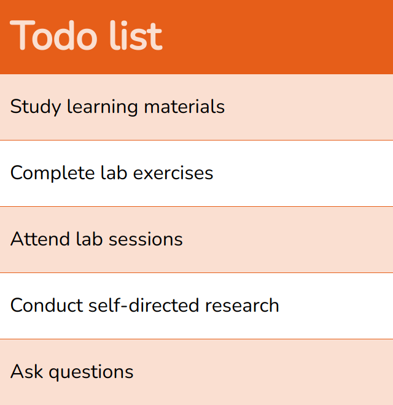
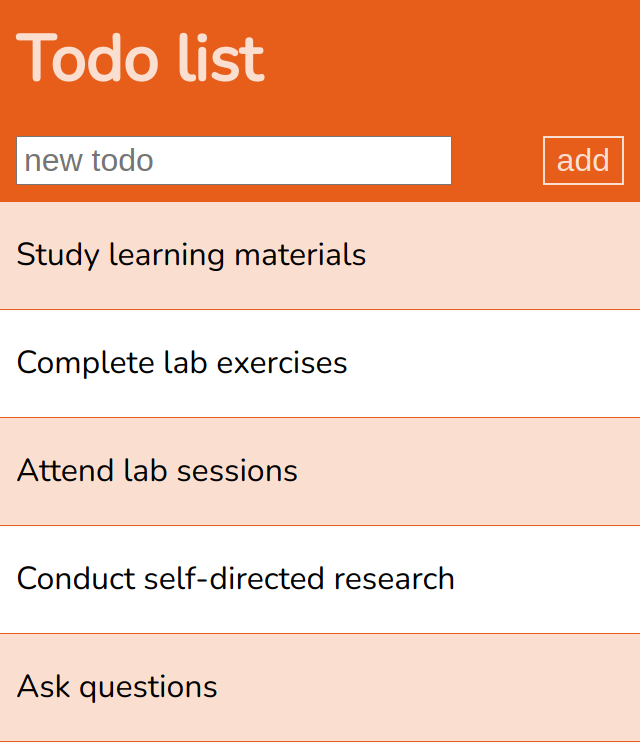
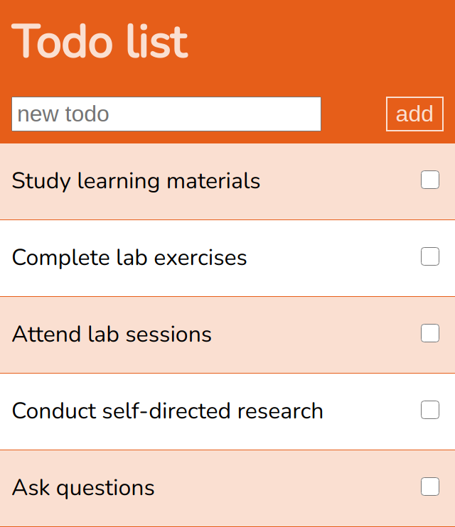
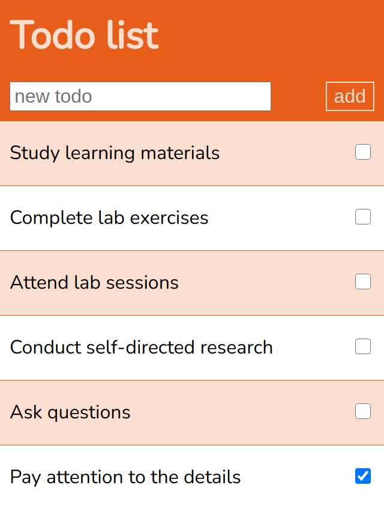
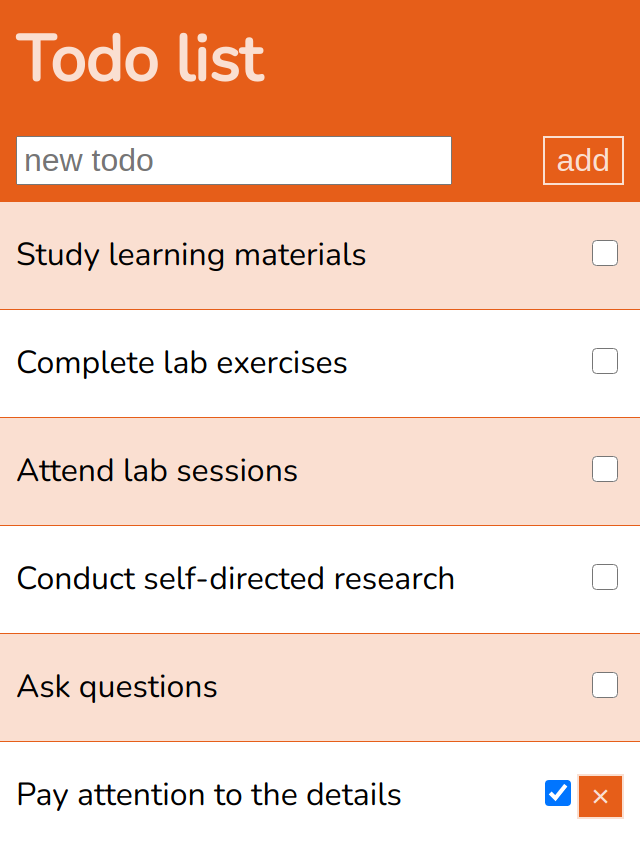
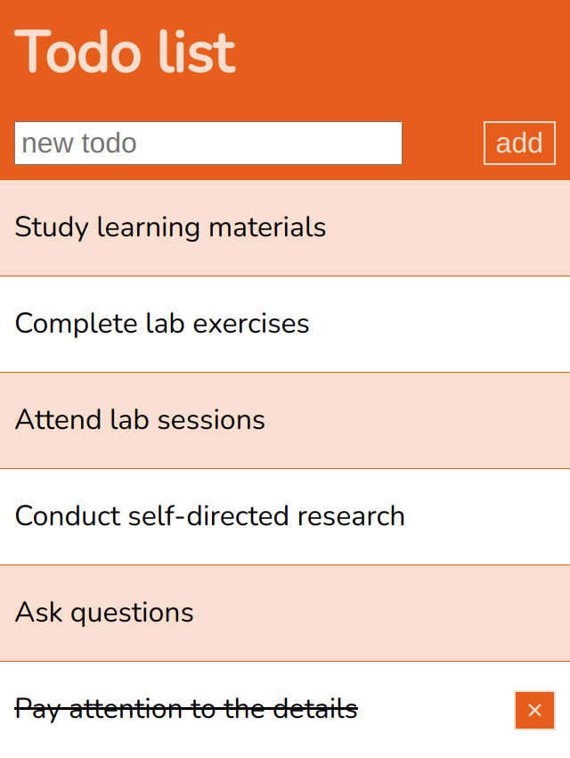
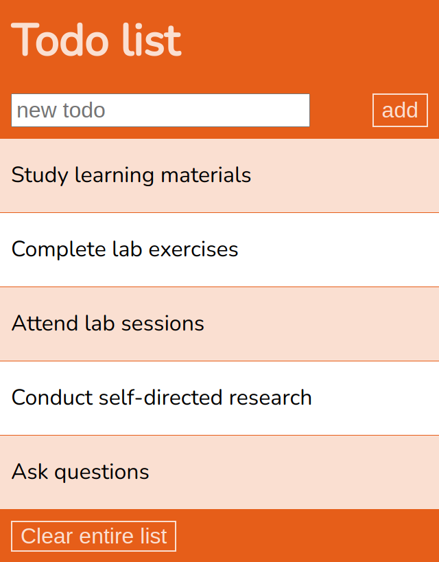
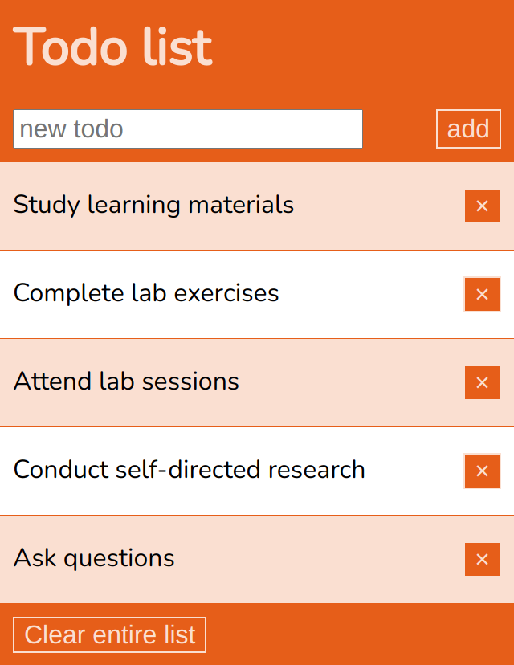
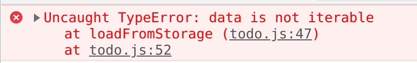

# Lab 6: A todo list application

In the following lab exercises, we will learn how to create, insert and remove DOM nodes.
We will also work with the browser’s local storage data store.

In this example, we will build a todo list application.
The basic functional requirements are as follows:

- Users can add items to the list
- Users can mark list items as **done**
- Users can remove items from the list
- Users can clear the entire list
- List items and their **done** state will be remembered by the browser

Take this lab slowly and try to understand each step.
We are integrating a lot of stuff we have already learned and adding new stuff too.

Ask questions as soon as they arise.
Don't continue to the next step until you understand the current step.

## Build a list

First we will need a list in our document.
Start with a standard template and add a simple `<header>` containing an `<h1>` and a `<main>` element containing a single `<ul>` (an [unordered list][ulElement]).
This will become the core of our todo list.

> use an `<ol>` element (ordered list) if you want numbering.

```html
<!DOCTYPE html>
<html lang="en">
  <head>
    <meta charset="utf-8">
    <meta name="viewport" content="width=device-width, initial-scale=1.0">
    <title>Todo list</title>
    <link rel="stylesheet" href="todo.css">
  </head>
  <body>
    <header>
      <h1>Todo list</h1>
    </header>
    <main>
      <ul id="todo"></ul>
    </main>
    <script src="todo.js"></script>
  </body>
</html>
```
> The list is given the id `todo` so we can conveniently access it in JavaScript.

## Adding list items

In our finished app we want [list item][li] elements (`<li>`) to be created via JavaScript in response to user input.
Before we move on to the JavaScript we should spend some time designing the list items.

### Start with a *hard-coded* list

Our first iteration will be hard-coded into the HTML and very minimal.
Each element will only contain a description of the `todo` item.
Just some text.

Insert a series of `<li>` elements into your `<ul>` element to remind us to keep up to date with module activities.

```html
<ul id="todo">
  <li>Study learning materials</li>
  <li>Complete lab exercises</li>
  <li>Attend lab sessions</li>
  <li>Conduct self-directed research</li>
  <li>Ask questions</li>
</ul>
```

Now we should style it a bit to put our basic *look and feel* in place for mobile devices.

Apply the following style rules.
Adapt this if you like, but be careful.
We will be building on top of these styles.

> Notice we used different filenames this time, just to mix it up.
Make sure your file is called `todo.css`

```css
@import url('https://fonts.googleapis.com/css2?family=Nunito&display=swap');

:root {
  --hue: 20;
  --dark: hsl(var(--hue), 80%, 50%);
  --light: hsl(var(--hue), 80%, 90%);
}

body {
  font-family: Nunito, sans-serif;
  max-width: 600px;
  margin: 0 auto;
}

header {
  background-color: var(--dark);
  color: var(--light);
  overflow: auto;
  padding: 0.5rem;
}

h1 {
  margin: 0;
}


ul {
  list-style: none;
  user-select: none;
  padding: 0;
  margin: 0;
}

li {
  padding: 1em 0.5rem;
  margin: 0;
  border: 0px solid var(--dark);
}

li:nth-child(odd) {
  background-color: var(--light);
  border-width: 0.5px 0;
}

```


<figcaption style="text-align: center; margin-bottom: 1em">A styled list</figcaption>


Notice the use of custom properties, choose a different `--hue` if you want (0 - 360).
You may need to tweak the colour contrast a bit.

Also notice the use of `user-select: none`, this prevents the text within our list from being selected.
This will become useful later when users are clicking on elements.

### Adding new items

Now we need to implement our first functional requirement **Users can add items to the list**.

First, we will create a JavaScript function that will add a new list item.

```js
"use strict";

function addItem(text) {
  const item = document.createElement('li');
  item.textContent = text;
  todo.appendChild(item);
}
```

The function takes a single argument, `text`.
This is the text we want to add into the list item.

We are calling [`document.createElement`][createElement] to create an [`<li>`][li] element.
Then we add the text into the `<li>` using [`node.textContent`][textContent].
Finally, we append our new element as a child of the `<ul>` element (the one with `id="todo"`) using [`node.appendChild`][appendChild].

Now try calling the new function.
In the developer console, type the following:

> don't add this code into your file, type it into the chrome developer console and see what it does

```js
addItem("Pay attention to the details");
```
> Stop and think.
Make sure you understand what is happening here.
Ask a question if you need clarification.

Your new item should have been added to the list.
All we need now is a way for the user to input text and an event listener to call the function.

Add the following `<section>` into the `<main>` element, above the `<ul>`.

```html
<section>
  <input id="text" placeholder="new todo" aria-label="new todo">
  <button id="add">add</button>
</section>
```

> This should be familiar from the last lab.
Its just an `<input>` and a `<button>`.

We need some additional styles to handle this.

```css
section {
  display: flex;
  justify-content: space-between;
}

input, button {
  font-size: 1em;
}

button {
  border: 1px solid var(--light);
  background-color: var(--dark);
  color: var(--light);
}
```

and update the `header` selector.

```css
header, section {
  background-color: var(--dark);
  color: var(--light);
  overflow: auto;
  padding: 0.5rem;  
}
```

> By providing a comma-separated list of elements to the ruleset selector, the `<section>` and `<header>` elements are being given the same styles.



<figcaption style="text-align: center; margin-bottom: 1em">List with basic user input</figcaption>


Finally, we need an event listener on the new `<button>`.

```js
add.addEventListener('click', ev => {
  addItem(text.value);
});
```

In the first draft of our app our user can add items by typing something into the `<input>` and clicking the `add` button.
Refreshing the page returns us back to the original hard-coded list.

### Marking an item as *done*

Storing a boolean *done* field in the DOM can be implemented in many ways.
However, by using a `<label>` with an `<input>`, we get some free accessibility and can easily leverage css to provide the user interface.

First, let's design the DOM structure we need.
Update the list items as follows.

```html
<ul id="todo">
  <li>
    <label for="todo1">Study learning materials</label>
    <input type="checkbox" id="todo1">
  </li>
  <li>
    <label for="todo2">Complete lab exercises</label>
    <input type="checkbox" id="todo2">
  </li>
  <li>
    <label for="todo3">Attend lab sessions</label>
    <input type="checkbox" id="todo3">
  </li>
  <li>
    <label for="todo4">Conduct self-directed research</label>
    <input type="checkbox" id="todo4">
  </li>
  <li>
    <label for="todo5">Ask questions</label>
    <input type="checkbox" id="todo5">
  </li>
</ul>
```
> Notice that each `<li>` element is structured identically.
Later on, we will build the structure with code.

Now we can mark the item as `done` by checking the input.

Update the styles to make the list items `display: flex` and `justify-content: space-between`.

```css
li {
  padding: 1em 0.5rem;
  margin: 0;
  border: 0px solid var(--dark);
  display: flex;
  justify-content: space-between;
}
```

Now we can click on the label and the box is toggled.
However, the gap between the label and the input is not clickable.
Fix this by growing the label element.

```css
label {
  flex-grow: 1;
}
```


<figcaption style="text-align: center; margin-bottom: 1em">List with checkboxes for marking as done</figcaption>

Obviously, adding an item via the user interface still generates the old, simpler `<li>` structure.
So we need to update our `addItem` function.

```js
function addItem(text, done) {
  const item = document.createElement('li');
  const label = document.createElement('label');
  const input = document.createElement('input');
  label.textContent = text;
  input.type = "checkbox";
  input.checked = done;
  input.id = `todo${todo.querySelectorAll('li').length + 1}`;
  label.htmlFor = input.id;
  item.appendChild(label);
  item.appendChild(input);
  todo.appendChild(item);
}
```

Study the above function carefully.
We are generating a nested structure of elements and configuring the elements with the data provided to the function arguments.
The label and input elements are linked together by a unique identifier constructed by counting how many elements are in the list.

The system now works as we want.
New items are given an empty checkbox.
Try calling the function from the developer console and pass in `true` as the second argument.

> Again, don't add this code into your javascript file.
This should be tried in the developer console.


```js
addItem("Pay attention to the details", true);
```

This should tick the box.


<figcaption style="text-align: center; margin-bottom: 1em">New items can be added with the checkbox checked</figcaption>

Refreshing the page still reverts the list back to the original hard-coded items.

### Removing items from the list

To remove an item from the list requires a clickable element within each list item.
We are going to use a `<button>` to do this job.

However, we also need to add an event listener to each of these button elements.
The event listener must know which item to remove from the list.
So this time, we will start by updating the `addItem` function with the following additional code.

> Insert this code into your `addItem` function.

```js
const button = document.createElement('button');
button.textContent = "×";
button.addEventListener('click', ev => {
  item.remove();
});
item.appendChild(button);
```

>Try to think about how you would organise the function, it will get a lot longer before we are finished.
Make sure you add these lines after the `item` element is created.

The above code adds a button into the list item.
The button is also given an event listener which deletes the list item from the DOM when the button is clicked.
Try it.
Add an item via the interface and click the button in the new item.
You should see it works as intended.

>The event listener is forming what is known as a closure - the value of the `item` variable becomes part of the context of the event listener and remains part of the event listener scope even after the original `additem` function call ends.

However, add a new element and you will see we have introduced a *visual bug*.
The label, input checkbox and button together are not looking good.
More importantly, the clickable elements are too close together for a good mobile interface.


<figcaption style="text-align: center; margin-bottom: 1em">Controls are too close together</figcaption>

> For touch interfaces think about the size of a large fingertip.

One solution is to hide the checkbox.
We can keep the checkbox in the document, but we will hide it using css.
This is OK because the label can still be used to toggle the hidden checkbox.

```css
input[type="checkbox"] {
  display: none;
}

input:checked + label {
  text-decoration: line-through;
}
```

Notice, we have also used the
[adjacent sibling combinator](https://developer.mozilla.org/en-US/docs/Web/CSS/Adjacent_sibling_combinator)
to select all labels that **follow** checked inputs.
We style these with a line-through to indicate they are "done".

Think about this for a while.
The labels need to come after the inputs in the DOM.
It means we need to swap the order of the inputs and the labels.

So in the `addItem` function, swap the elements around.
Append the input first, then the label.

>You should already have these lines, just swap the order

```js
item.appendChild(input);
item.appendChild(label);
```

You can also swap the order of the elements in the HTML file.

>Swap them, do it.
Go to your HTML file and swap the order of the labels and inputs.

Notice that if you do this then clicking the label will visibly mark the item as "done".


<figcaption style="text-align: center; margin-bottom: 1em">Cleaner interface with line-through instead of checkbox</figcaption>

Now, for newly added items at least, we can delete the item from the list with a click.
Leave them for now but in our final app, we will remove the hard-coded items.

### Clearing the entire list

Deleting all the elements in the list requires a clickable element for the user.
Add a `<footer>` with a `<button>` like this after your `<main>` element.

```html
<footer>
  <button id="clear">Clear entire list</button>
</footer>
```

We can add the footer into the `header, section` selector to get some free styles.

>Hey this is nice, we can re-use existing styles without creating a mess

```css
header, section, footer {
  background-color: var(--dark);
  color: var(--light);
  overflow: auto;
  padding: 0.5rem;  
}
```


<figcaption style="text-align: center; margin-bottom: 1em">Clear button in the footer</figcaption>

The JavaScript requirements are pretty minimal.

```js
function clearList() {
  while(todo.firstChild) {
    todo.removeChild(todo.firstChild);
  }
}

clear.addEventListener('click', ev => {
  clearList();
});
```

Using a [`while`][while] loop we call [`Node.firstChild`][firstChild] to identify the next element and [`Node.removeChild`][removeChild] to remove each element in turn.
[`Node.firstChild`][firstChild] will return false if there are no child elements.

Now the interface is nearly complete.
Although still, refreshing the page causes all our updates to be lost.
Before we store the list in local storage, we can add a few refinements.

### Refinements

There are a few issues with the user interface we need to improve.

- Clicking the add button when the text input field is empty should do nothing
- Once an item is added, the text input field should be cleared and be given the focus
- Pressing enter should trigger the item to be added

We can address the first two points easily.
Setting the input value to `null` clears the field.
Calling [`text.focus()`](https://developer.mozilla.org/en-US/docs/Web/API/HTMLOrForeignElement/focus) places the cursor back in the input element ready for the next item to be added.

>This is another update.
You should already have this event listener.
We are updating the existing code here.

```js
add.addEventListener('click', ev => {
  if(text.value) {      // check we have data
    addItem(text.value);
    text.value = null;  // clear the input
    text.focus();       // give it the focus
  }
});
```

To add an item when the enter key is pressed we can add an event listener on the input element listening for the [`keydown`](https://developer.mozilla.org/en-US/docs/Web/API/Document/keydown_event) event.
We can test the `event.key` property and if it is `Enter` then we can trigger the add button `click` event.

```js
text.addEventListener('keydown', ev => {
  if(ev.key == "Enter") {
    add.click();
  }
});
```

Try it out.
We can now add multiple items easily.

## Enable local storage

To save our list to local storage we need to cover a number of situations.

- When the page is loaded, it should check the local storage for data
- When a new item is added, it should update local storage
- When an item is removed, it should update local storage
- When an item is marked as done (or not done) it should update local storage
- When the list is cleared, it should update local storage.

### Data structure

Local storage can only store strings.
Typically this means we store data as [JSON](https://www.json.org/json-en.html).
JSON can be converted into JavaScript objects using [`JSON.parse()`](https://developer.mozilla.org/en-US/docs/Web/JavaScript/Reference/Global_Objects/JSON/parse).
JavaScript objects can be converted into JSON using [`JSON.stringify()`](https://developer.mozilla.org/en-US/docs/Web/JavaScript/Reference/Global_Objects/JSON/stringify).

We need two functions.
One will strip the data to be stored from the DOM and save it to local storage as a string.
The other will load the string from local storage and populate the DOM using our `clearList` and `addItem` functions.

The data structure will be an Array of Objects, like this:

```js
[
  {text: "Study learning materials", done: true},
  {text: "Complete lab exercises", done: false},
  {text: "Attend lab sessions", done: false},
  {text: "Conduct self-directed research", done: false},
  {text: "Ask questions", done: false}
]
```

### Save data to storage

We can strip this data out of the DOM like this.

```js
function saveToStorage() {
	const elements = Array.from(todo.querySelectorAll('li'));
	const data = elements.map(el => {
		 return {
       text: el.querySelector('label').textContent,
			 done: el.querySelector('input').checked
		 }
	});
	localStorage.setItem(todo.id, JSON.stringify(data));
}
```

The `saveToStorage` function grabs all the `<li>` elements using [`Element.querySelectorAll`](https://developer.mozilla.org/en-US/docs/Web/API/Element/querySelectorAll) and converts this into an Array using [`Array.from`](https://developer.mozilla.org/en-US/docs/Web/JavaScript/Reference/Global_Objects/Array/from).
The [`Array.map`](https://developer.mozilla.org/en-US/docs/Web/JavaScript/Reference/Global_Objects/Array/map) function is perfect for transforming the array of elements into our data structure.
We extract the label text and the input boolean value for each element into an object and `Array.map` converts the result into an array.
Finally, we use [`localStorage.setItem()`](https://developer.mozilla.org/en-US/docs/Web/API/Storage/setItem) to store the data.
We pass the data through `JSON.stringify` before storing it, using the list `id` attribute as a key.

In the developer tools click on the `Application` tab.
Under `Storage` you should see `Local Storage`.
Open the `Local Storage` menu and select the item for your page (usually `file://`).
This should reveal a table of data with columns for `key` and `value`.
This is your local storage database.

Now, in the console, call our `saveToStorage` function.

>Again, don't put this in your file, just type it into the console.
It should create a record in local storage.

```js
saveToStorage();
```

You should see a new row appear in the table for `todo`.

### Load data from storage

The data is in the format we want and so we should be able to load it in from localStorage.

In your JavaScript, add the following:

```js
function loadFromStorage() {
	clearList();
	const data = JSON.parse(localStorage.getItem(todo.id));
	for (const item of data) {
		addItem(item.text, item.done);
	}
}

loadFromStorage();

```

>Here we are actually calling the function in our javascript code.

Our `loadFromStorage` function first clears the list using the existing `clearList` function.
We then get the string data from `localStorage` and use `JSON.parse` to convert it back into and array of JavaScript objects.
Finally, we loop over the array and add each item in turn using our existing `addItem` function.

We call the function when the page loads.
This clears the hard-coded items and replaces them with dynamically generated ones.
We can see this is working because they now have working delete buttons.


<figcaption style="text-align: center; margin-bottom: 1em">Data loaded from localStorage</figcaption>


### Updating the stored list

Refreshing the page reloads the full list from `localStorage`.
However, we still need to update the stored data (using our `saveToStorage` function) whenever the user changes the list.

We can start with the `add` event listener.
Just add a call to `saveToStorage()` after the DOM is updated.

>Find this in your code and add the new line

```js
add.addEventListener('click', ev => {
	if(text.value) {
		addItem(text.value);
		text.value = null;
		text.focus();
		saveToStorage(); // <-- this is a new line
	}
});
```

Now you should find that the browser remembers any items you add.
But they can't be deleted.

So we need to update the event listener we add to each button element **within** the `addItem` function.
Again, we just need to update the stored data when we make a change to the list.

>Just add the new line into your existing code

```js
button.addEventListener('click', ev => {
  item.remove();
  saveToStorage(); // <-- this is a new line
});
```

Now you should be able to add and delete items and the list will be updated in `localStorage` and remembered by the browser.

We also need to add a new event listener within the `addItem` function to listen for the `input` event of the hidden checkbox elements.

>This new code goes within your `addItem` function

```js
input.addEventListener('input', ev => {
  saveToStorage();
});
```

The complete function now looks like this.

```js
function addItem(text, done) {
	const item = document.createElement('li');
	const label = document.createElement('label');
	const input = document.createElement('input');
	const button = document.createElement('button');
	label.textContent = text;
	input.type = "checkbox";
	input.checked = done;
	input.id = `todo${todo.querySelectorAll('li').length + 1}`;
	input.addEventListener('input', ev => {
		saveToStorage();
	});
	label.htmlFor = input.id;
	button.textContent = "×";
	button.addEventListener('click', ev => {
		item.remove();
		saveToStorage();
	});
	item.appendChild(input);
	item.appendChild(label);
	item.appendChild(button);
	todo.appendChild(item);
}
```

The final thing we need is to update the stored data when we delete the full list.
Since this is destructive and irreversible we could also add a confirm dialogue.

```js
clear.addEventListener('click', ev => {
  if(confirm("Are you sure you want to delete the entire list?")) {
    clearList();
    saveToStorage(); // <-- this is a new line    
  }
});
```

Now we have a fully functional todo app!
There are still one or two wrinkles we need to sort out.

If you view the local storage database and clear the todo item from the list then we get an error when the page is refreshed.


<figcaption style="text-align: center; margin-bottom: 1em">Console error (your line numbers may be different)</figcaption>


This is because our `loadFromStorage` code relies on this record existing.
So we need to handle the case when there is no record in localStorage (i.e. the first time the app is loaded on a particular device).

Update the `loadFromStorage` function to handle this.

```js
function loadFromStorage() {
	const data = JSON.parse(localStorage.getItem(todo.id));
	if(data) {
		clearList();
		for (const item of data) {
			addItem(item.text, item.done);
		}
	}
}
```

Now we check to see if the record exists (it may be empty) before we attempt to iterate over it.

If you got this far, well done.

## Tidy up

Now we have a working system we will protect all our code inside a self-executing anonymous function.

```Javascript
(() => {
  // all existing code goes here
})()
```

This keeps all our variables cleanly outside of the global scope.
Try it, you can no longer call the `addItem` function from the developer console.

This is the final code:

### index.html

```html
<!DOCTYPE html>
<html lang="en">
	<head>
		<meta charset="utf-8">
		<meta name="viewport" content="width=device-width, initial-scale=1.0">
		<title>Todo list</title>
		<link rel="stylesheet" href="todo.css">
	</head>
	<body>
		<header>
			<h1>Todo list</h1>
		</header>
		<main>
			<section>
				<input id="text" placeholder="new todo" aria-label="new todo">
				<button id="add">add</button>
			</section>
			<ul id="todo">
				<li>
					<input type="checkbox" id="todo1">
					<label for="todo1">Study learning materials</label>
				</li>
				<li>
					<input type="checkbox" id="todo2">
					<label for="todo2">Complete lab exercises</label>
				</li>
				<li>
					<input type="checkbox" id="todo3">
					<label for="todo3">Attend lab sessions</label>
				</li>
				<li>
					<input type="checkbox" id="todo4">
					<label for="todo4">Conduct self-directed research</label>
				</li>
				<li>
					<input type="checkbox" id="todo5">
					<label for="todo5">Ask questions</label>
				</li>
			</ul>
		</main>
		<footer>
			<button id="clear">Clear entire list</button>
		</footer>
		<script src="todo.js"></script>
	</body>
</html>
```

### todo.css

```css
@import url('https://fonts.googleapis.com/css2?family=Nunito&display=swap');

:root {
	--hue: 20;
	--dark: hsl(var(--hue), 80%, 50%);
	--light: hsl(var(--hue), 80%, 90%);
}

body {
	font-family: Nunito, sans-serif;
	max-width: 600px;
	margin: 0 auto;
}

header, section, footer {
	background-color: var(--dark);
	color: var(--light);
	overflow: auto;
	padding: 0.5rem;
}

h1 {
	margin: 0;
}

section {
	display: flex;
	justify-content: space-between;
}

input, button {
	font-size: 1em;
}

button {
	border: 1px solid var(--light);
	background-color: var(--dark);
	color: var(--light);
}

ul {
	list-style: none;
	user-select: none;
	padding: 0;
	margin: 0;
}

li {
	padding: 1em 0.5rem;
	margin: 0;
	border: 0px solid var(--dark);
	display: flex;
	justify-content: space-between;
}

li:nth-child(odd) {
	background-color: var(--light);
	border-width: 0.5px 0;
}

label {
	flex-grow: 1;
}

input[type="checkbox"] {
	display: none;
}

input:checked + label {
	text-decoration: line-through;
}
```

### todo.js

```js
"use strict";
(() => {

	function addItem(text, done) {
		const item = document.createElement('li');
		const label = document.createElement('label');
		const input = document.createElement('input');
		const button = document.createElement('button');
		label.textContent = text;
		input.type = "checkbox";
		input.checked = done;
		input.id = `todo${todo.querySelectorAll('li').length + 1}`;
		input.addEventListener('input', ev => {
			saveToStorage();
		});
		label.htmlFor = input.id;
		button.textContent = "×";
		button.addEventListener('click', ev => {
			item.remove();
			saveToStorage();
		});
		item.appendChild(input);
		item.appendChild(label);
		item.appendChild(button);
		todo.appendChild(item);
	}

	function clearList() {
		while(todo.firstChild) {
			todo.removeChild(todo.firstChild);
		}
	}

	function saveToStorage() {
		const elements = Array.from(todo.querySelectorAll('li'));
		const data = elements.map(el => {
			return {
				text: el.querySelector('label').textContent,
				done: el.querySelector('input').checked
			}
		});
		localStorage.setItem(todo.id, JSON.stringify(data));
	}

	function loadFromStorage() {
		const data = JSON.parse(localStorage.getItem(todo.id));
		if(data) {
			clearList();
			for (const item of data) {
				addItem(item.text, item.done);
			}
		}
	}

	add.addEventListener('click', ev => {
		if(text.value) {
			addItem(text.value);
			text.value = null;
			text.focus();
			saveToStorage();
		}
	});

	clear.addEventListener('click', ev => {
		clearList();
		saveToStorage();
	});

	text.addEventListener('keydown', ev => {
		if(ev.key == "Enter") {
			add.click();
		}
	});

	loadFromStorage();
})()
```

---


---


# Challenge

The app is now fairly functional. However, think about what happens when the app is opened in two tabs simultaneously.

Try opening the todo list in two separate browser tabs and work with each list in turn.
Notice what happens to your edits?

Implement an improvement to avoid this problem.

potential solutions include implementing an explicit and manual load/save option or using the [`storage`][storageEvent] event to keep all tabs synchronised.

>hint: the storage event triggers when another page edits the stored data.
Its relatively easy to simply call our existing code in response to this event.
Are any changes required?


[addEventListener]: https://developer.mozilla.org/en-US/docs/Web/API/EventTarget/addEventListener "AddEventListener - MDN"

[Array.prototype.map]: https://developer.mozilla.org/en-US/docs/Web/JavaScript/Reference/Global_Objects/Array/map "Array.prototype.map - MDN"

[String.prototype.split]: https://developer.mozilla.org/en-US/docs/Web/JavaScript/Reference/Global_Objects/String/split "String.prototype.split - MDN"

[String.prototype.slice]: https://developer.mozilla.org/en-US/docs/Web/JavaScript/Reference/Global_Objects/String/slice "String.prototype.slice - MDN"

[textContent]: https://developer.mozilla.org/en-US/docs/Web/API/Node/textContent "Node.textContent - MDN"

[onbeforeunload]: https://developer.mozilla.org/en-US/docs/Web/API/WindowEventHandlers/onbeforeunload "beforeunload event - MDN"

[DOMContentLoaded]: https://developer.mozilla.org/en-US/docs/Web/API/Window/DOMContentLoaded_event "DOMContentLoaded event - MDN"

[ulElement]: https://developer.mozilla.org/en-US/docs/Web/HTML/Element/ul "The unordered list element - MDN"

[li]: https://developer.mozilla.org/en-US/docs/Web/HTML/Element/li "The list item element - MDN"

[createElement]: https://developer.mozilla.org/en-US/docs/Web/API/Document/createElement "document.CreateElement - MDN"

[textContent]: https://developer.mozilla.org/en-US/docs/Web/API/Node/textContent "node.textContent - MDN"

[appendChild]: https://developer.mozilla.org/en-US/docs/Web/API/Node/appendChild "node.appendChild - MDN"

[forEach]: https://developer.mozilla.org/en-US/docs/Web/JavaScript/Reference/Global_Objects/Array/forEach "Array.prototype.forEach - MDN"

[while]: https://developer.mozilla.org/en-US/docs/Web/JavaScript/Reference/Statements/while "while - MDN"

[firstChild]: https://developer.mozilla.org/en-US/docs/Web/API/Node/firstChild "Node.firstChild - MDN"

[removeChild]: https://developer.mozilla.org/en-US/docs/Web/API/Node/removeChild "Node.removeChild - MDN"

[spread]: https://developer.mozilla.org/en-US/docs/Web/JavaScript/Reference/Operators/Spread_syntax "spread syntax - MDN"

[localStorage]: https://developer.mozilla.org/en-US/docs/Web/API/Window/localStorage "local storage - MDN"

[storageEvent]: https://developer.mozilla.org/en-US/docs/Web/API/Window/storage_event "storage event - MDN"
