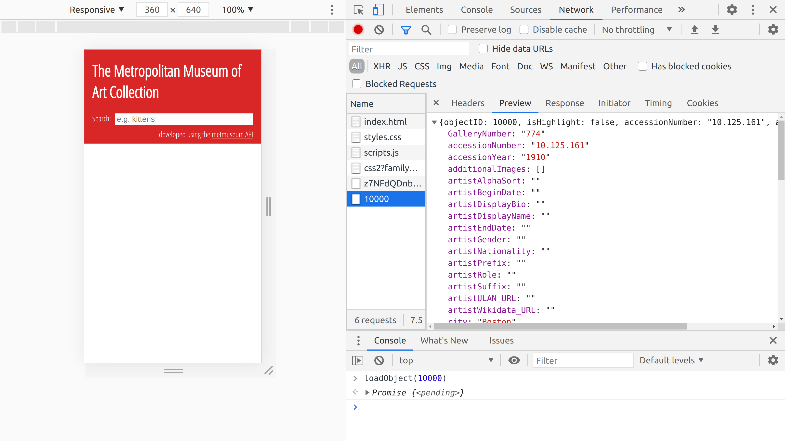
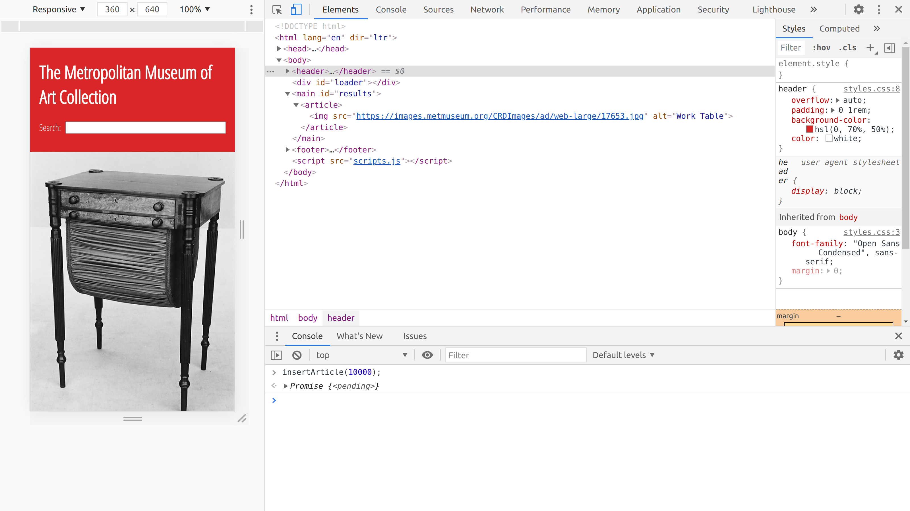
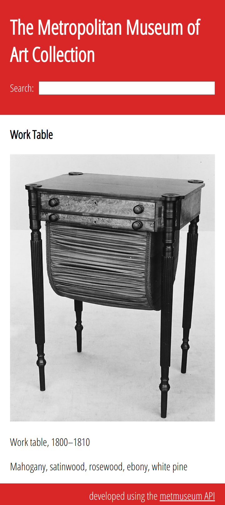
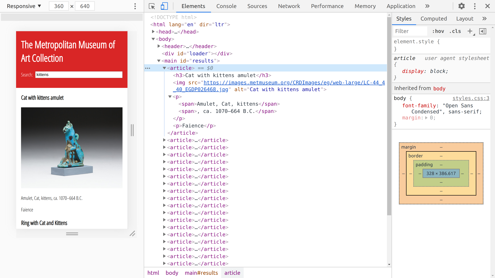
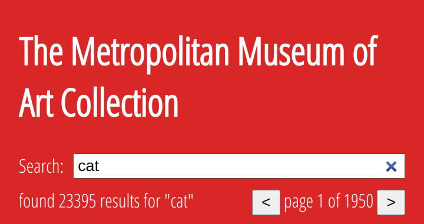

# Lab 7: Working with APIs

In this week's lab we will build a fully featured search and display application for the online collection of the [Metropolitan Museum of Art](https://www.metmuseum.org/).

The museum provides [free access to 406,000 images](https://www.metmuseum.org/blogs/now-at-the-met/2018/met-collection-api) and detailed data including descriptions, dates and artist details for hundreds of thousands of objects within the collection.

Not all information fields are available for all elements so we will work with a small subset of the available data in this demonstration.
Feel free to elaborate and develop the system further after you complete the example code.

In this example, we will build an application that will allow users to enter a search term and view paginated results.

The basic functional requirements are as follows:

- Users can enter a search term
- On searching, users are presented with details of any matching items
- If more than 12 items match the search, users can navigate 12 items at a time with previous and next buttons
- Users can filter the results by department

As with last week, take this lab slowly and try to understand each step.
Ask questions as soon as they arise.
Don't continue to the next step until you understand the current step.

## A basic template

As usual, we begin with a standard template.

```html
<!DOCTYPE html>
<html lang="en" dir="ltr">
  <head>
    <meta charset="utf-8">
    <title>The Metropolitan Museum of Art</title>
    <meta name="viewport" content="width=device-width, initial-scale=1.0">
    <link rel="stylesheet" href="styles.css">
  </head>
  <body>
    <header>
      <h1>The Metropolitan Museum of Art Collection</h1>
      <section id="search">
        <label for="query">Search:</label>
        <input id="query" type="search">
      </section>
    </header>
    <main id="results"></main>
    <footer>
      developed using the <a href="https://metmuseum.github.io/">metmuseum API</a>
    </footer>
    <script src="scripts.js"></script>
  </body>
</html>
```

There is nothing much unusual or exciting about this template.
It has a `section#search` within the header.
This is the main user interface, a single `<input>` of type `search` will generate a query for the museum search API.

It also has a `main#results` element into which we will insert the results.
At the end of the `<body>` we have also included a footer with a link to the API documentation.

The template includes the usual stylesheet and script files.

Add the following styles.

```css
@import url('https://fonts.googleapis.com/css2?family=Open+Sans+Condensed:wght@300&display=swap');

body {
  font-family: "Open Sans Condensed", sans-serif;
  margin: 0;
}

header {
  overflow: auto;
  padding: 0 1rem;
  background-color: hsl(0, 70%, 50%);
  color: white;
}

#search {
  display: grid;
  grid-column-gap: 0.5em;
  grid-template-columns: min-content 1fr;
}

#search h2 {
  grid-column: 1 / 3;
}

footer {
  text-align: right;
  padding: 0.5em 1rem;
  background-color: hsl(0, 70%, 50%);
  color: white;
}

footer a {
  color: inherit;
}
```

There's not much here.
We are providing some basic spacing, a font and some colours.
We also organise the `section#search` element with `display: grid`.
Notice that the `h2` element is spread across both columns.

## The metmuseum.org API

Documentation for the API can be found at [https://metmuseum.github.io/](https://metmuseum.github.io/).
Spend a few minutes browsing the page.
In particular, we will be using the [object](https://metmuseum.github.io/#object) and [search](https://metmuseum.github.io/#search) endpoints.

We can see that the search endpoint will provide us with a list of objectIDs for artifacts that match the search criteria and the object endpoint provides data for an individual item.
It is no coincidence that this is exactly what is needed for a simple app.

So, the first job is to work out how to handle an objectID.
We need to access data for a given objectID and build out elements in our DOM to represent individual museum artifacts.

### Object

Accessing individual objects is simple.
The endpoint requires an `objectID` for the object.

```http
GET /public/collection/v1/objects/[objectID]
```

>This is straight from the API [documentation](https://metmuseum.github.io/#object).

If we make an HTTP request for this url (with the appropriate base url and a value for objectID) then the result will be some JSON data.
Details of the format of the response we can expect is provided in [the documentation](https://metmuseum.github.io/#object).

It looks something like this:

```json
{
  "objectID":10000,
  "isHighlight":false,
  "primaryImage":"https://images.metmuseum.org/CRDImages/ad/original/17653.jpg",
  "primaryImageSmall":"https://images.metmuseum.org/CRDImages/ad/web-large/17653.jpg",
  "department":"The American Wing",
  "objectName":"Work table",
  "title":"Work Table",
  "culture":"American",
  "artistRole":"",
  "artistDisplayName":"",
  "artistDisplayBio":"",
  "objectDate":"1800–1810",
  "medium":"Mahogany, satinwood, rosewood, ebony, white pine",
  "classification":"Furniture"
}
```

> This isn't all of it, the actual response contains a lot more fields.
These are just some of the ones we might be interested in using.

In fact, we can access documents directly with our browser.
See [object number 10000](https://collectionapi.metmuseum.org/public/collection/v1/objects/10000) for example.
Changing the objectId in the url requests data for different artifacts.

#### Getting the data with JavaScript

We can get the data for an object using JavaScript with an `async` function.

```js
async function loadObject(id) {
  const url = `https://collectionapi.metmuseum.org/public/collection/v1/objects/${id}`;
  response = await fetch(url);
  return response.json();
}
```

> Functions declared as `async` will always return a `Promise` and so they can use the `await` keyword to make working with promises easier.

In the first line, we construct the url for an object based on the provided `id` argument.
Then we `fetch` the url using the `await` keyword so execution pauses until the `Promise` returned by `fetch` resolves to an actual `Response` object.
We return the result of the `response.json()` method, which is also a promise.

When the promise returned by our async function is resolved, it will read the body of the request to completion and parse the JSON data within.

Type this into the developer console

>This loads data for object number 10000 shown partially above.

```js
loadObject(10000);
```

The result is a `Promise` object.
By calling the function, the promise is activated and the request is made asynchronously.
In the background, the request is resolved and the data are loaded.
We can see this in the `network` panel in the developer tools.

In the Chrome developer tools, look at the `network` panel.
You should see all the http requests made by your page.
These will include an item called `10000`.
Click on it and look at the `preview`.


<figcaption style="text-align: center; margin-bottom: 1em">museum object data</figcaption>

You should see a large data object like the one above.

> The request is made when you call the function, use the up arrows in your console and press enter to call the function again.
You should see the request being made every time.
Try requesting different objects.

To access the data within the console we need to call `then` on the promise.

```js
loadObject(10000).then(obj => console.log(obj))
```
>This is a shorter way to do the same thing
```js
loadObject(10000).then(console.log)
```

Let's do something with these data.

#### Building the DOM

We need to build DOM elements based on our data so we can see the object in our page.
We will create a separate function for this as it is a distinct piece of logic well-suited to a function of its own.

Our function takes a data object as input and returns an `<article>` element as output.
We will adapt this later but for now, we are just using the `primaryImageSmall` property of our data to generate an `` element so we can see what the object looks like.
So our `<article>` only has one element inside it for now.

```js
function buildArticleFromData(obj) {
  const article = document.createElement("article");
  const img = document.createElement("img");
  img.src = obj.primaryImageSmall;
  img.alt = obj.title;
  article.appendChild(img);
  return article;
}
```
> This approach should be familiar to you from last week
We also add an `alt` attribute based on the object `title`.


Now we have code to access the data and code to construct our DOM elements.
The last thing we need to do is to insert the article into the page.
For now we can write a simple function like this to carry out these three basic steps.

```js
async function insertArticle(id) {
  obj = await loadObject(id);
  article = buildArticleFromData(obj);
  results.appendChild(article);
}
```

>Again, we are using `async` here because it allows us to use `await` when we call `loadObject` (avoiding the need for a `then()` block).
It also means that the function returns a `Promise` even though we don't return a value explicitly.

Before we continue, we need to add some styles to fit our image to the viewport (we are still only working on the default styles for the mobile size).

```css
img {
  width: 100%;
}
```

Now call our new `insertArticle` function in the console to see what our object looks like.


```js
insertArticle(10000);
```
> Don't put the above line in your file. It goes in the developer console.

Notice that, even though our function doesn't have a return value, the console shows the return value is a `Promise`.
This is because it is an `async` function.

Now our app is starting to take shape.


<figcaption style="text-align: center; margin-bottom: 1em">an image is inserted into the DOM</figcaption>

This is good progress.
With very little code we have a way to generate an article based on the museum API objectID value.

Let's upgrade our `<article>` so we get a bit more information.

```js
function buildArticleFromData(obj) {
  const article = document.createElement("article");
  const title = document.createElement("h2");
  const primaryImageSmall = document.createElement("img");
  const objectInfo = document.createElement("p");
  const objectName = document.createElement("span");
  const objectDate = document.createElement("span");
  const medium = document.createElement("p");

  title.textContent = obj.title;
  primaryImageSmall.src = obj.primaryImageSmall;
  primaryImageSmall.alt = obj.title;
  objectName.textContent = obj.objectName;
  objectDate.textContent = `, ${obj.objectDate}`;
  medium.textContent = obj.medium;

  article.appendChild(title);
  article.appendChild(primaryImageSmall);
  article.appendChild(objectInfo);
  article.appendChild(medium);

  objectInfo.appendChild(objectName);
  if(obj.objectDate) {
    objectInfo.appendChild(objectDate);
  }

  return article;
}

```

Study the code.
There is nothing complicated here.
We are building some structure into the `<article>`.
We have an `<h2>` element with the object `title`.
The `` is the same as before.
Then we add two `<p>` elements.
The first contains two `<span>` elements displaying the `objectName` and `objectDate` fields.
We have some logic to only display the `objectDate` if the field is available (mostly because we also gave it a leading comma which would look wrong by itself).
The final paragraph displays the `medium` field.

We should also add some styles to keep the articles lined up with everything else and make them appear nicely.

```css
article {
  animation: fadeIn 1s;
  padding: 0 1rem;
}

@keyframes fadeIn {
  0% { opacity: 0; }
  40% { opacity: 0; }
  100% { opacity: 1; }
}
```


>Note the use of `rem` units so that each element has the same padding.
Even if we changed the font-size within the elements, these would still line up.
> The animation allows us to keep the element invisible initially and then fade the opacity from zero to one when the element is inserted into the page.
We will look at animations in more detail next week.


<figcaption style="text-align: center; margin-bottom: 1em">a first-draft article design</figcaption>

Now we need to load some articles based on user input.

### Search

The [search endpoint](https://metmuseum.github.io/#search) is also pretty simple.

```http
GET /public/collection/v1/search
```

However, it includes a number of optional **query parameters** so its not quite as straight forward as accessing individual objects.

Query parameters are added at the end of a URL.
Each query parameter is a key/value pair of the form `key=value`.
They begin with a question mark `?` and are separated by ampersands `&`.

These are the parameters we are interested in using.

| Parameter | Notes |
| :-- | : -- : |
| q | The query string |
| hasImages | Filters the result to only include objects with images |
| isHighlight | Filters the result based on whether the museum considers items as *highlights* |

For example we can search the museum for all objects with  images that match the query *kittens*.
[The result](https://collectionapi.metmuseum.org/public/collection/v1/search?hasImages=true&q=kittens) can be viewed in a browser.

It looks something like this:

```json
{
  "total":22,
  "objectIDs":[546247,545955,744564,550922,557818,43402,47358,284,45667,552058,13576,558306,12940,335378,849551,712769,752009,56089,55920,545970,570696,436327]
}
```

>The [documentation](https://metmuseum.github.io/#search) makes sense if you study it.
JSON APIs will often have documentation like this.
Some documentation is better than others.
The best way to work it out is to experiment.


Try loading some of these artifacts using our `insertArticle` function in the console.

```js
insertArticle(546247);
insertArticle(545955);
insertArticle(744564);
```

This is pretty nice!
But we need to do the search with JavaScript.
We also need to give the user control over the query string and to loop over the results, inserting each into the page in turn.

#### Search with JavaScript

We will start with a function very similar to our existing `loadObject` function.

```js
async function loadSearch(query) {
  let baseURL = `https://collectionapi.metmuseum.org/public/collection/v1/search`;
  response = await fetch(`${baseURL}?hasImages=true&q=${query}`);
  return response.json();
}
```

This should not need much explanation.
We are setting the `hasImages` parameter to `true` and setting the `q` parameter dynamically based on the provided argument.

>It would be easy to extend this with more arguments to set more query parameters.

As with the `loadObject` function. We can call it from the developer console and see the result in the `network` panel.

> try this in the console, you should see the request in the `network` panel, click on it and select `preview` to view the response.

```js
loadSearch("kittens");
```

#### Add search results into the page

Now we have already done most of the work, we just need to plumb it together.
Add the following function to load the search results and add an article for each one in turn.
Our existing code does all the work.
This is a sign of good structure.

> #### BE CAREFUL!
Once this is in the code, if you search for something that produces a lot of results (e.g. "cat") then you could crash your page.
We will address this later, just use "kittens" as the search term for now.

```js
async function doSearch() {
  result = await loadSearch(query.value);
  result.objectIDs.forEach(insertArticle);
}
```
>We are using the value from the `input#query` element as our query string.
The API gives us an array of objectIDs.
The `forEach` method allows us to pass each of these ObjectIDs into our insertArticle function, one at a time.

#### Add an event listener

Now we can register our new function as a simple eventListener on the `change` event of the `input#query` element.

```js
query.addEventListener('change', doSearch);
```

Try it by typing "kittens" into the search field.


<figcaption style="text-align: center; margin-bottom: 1em">search is working</figcaption>

The full list of 22 articles are added to the page one by one.
This is brilliant, but there are a few issues with the user interface we need to consider.

- What happens when we search again?
- What if there are hundreds of results?
- Hold one, is the order consistent?
- What if the request takes ages?
- What about handling larger screens?

In the next section we will deal with each of these issues in turn.

## User interface issues

OK.
Stop celebrating.
There is more work to be done.

### What happens when we search again?

With the "kitten" results still in the page, try searching for "shark" and see what happens.

The results are (obviously) appended to the end of the list, just like we coded it.
We need our `doSearch` function to clear the results before it goes to work.
Let's call a function to do the job.

>Update the function, don't add a new copy!

```js
async function doSearch() {
  clearResults();
  result = await loadSearch(query.value);
  result.objectIDs.forEach(insertArticle);
}
```

Now we need to actually write the function.
This is a very common pattern for clearing out an element.

```js
function clearResults() {
  while(results.firstChild) {
    results.firstChild.remove();
  }
}
```
>This is much faster than approaches using `element.InnerHTML`.

You should now be able to search again and the old result will be cleared out.

### What if there are hundreds of results?

Some search terms produce a lot of results.
Hundreds or even thousands are not uncommon.
We don't really want to request this many items and insert them into the page all at once.
So we need a way to *paginate* the results.

Our relatively simple code is about to get more complicated.
We will take it one step at a time.

#### Meta-data

First, let's add in a bit of meta-data about the search result.
Insert this into the HTML.

```html
<section id="meta">
  <span id="count"></span>
</section>
```

Now update the content of the `span#count` element when we know how many results were returned.

```js
async function doSearch() {
  result = await loadSearch(query.value);
  count.textContent = `found ${result.objectIDs.length} results for "${query.value}"`;
  clearResults();
  result.objectIDs.forEach(insertArticle);
}
```

This is just a nice thing to do, very simple.

#### Pagination

Pagination will require some controls.
Update your `section#meta` element like this.

```html
<section id="meta">
  <span id="count"></span>
  <span id="pagination">
    <button id="prev">&lt;</button>
    page <span id="pageIndicator">0</span> of <span id="nPages">0</span>
    <button id="next">&gt;</button>
  </span>
</section>
```

>Above we are adding a `button#prev` and `button#next` elements to control pagination.
We also add a few slots to give the user information about which page they are on.

Some styles, just to place the elements.
```css
#meta {
  display: flex;
  justify-content: space-between;
  padding: 0.5em 0;
}
```

Now we need some code to do the pagination.
We need to keep a record of the search results (the array of objectIDs returned from the search endpoint).
We also need to know the size of each page and which page we are currently viewing.

Add this to the top of your file.

```js
let pageSize = 12;
let currentPage;
let objectIDs;
```

We are setting the `pageSize` to 12, so we will load 12 objects per page.
The value of `currentPage` will determine *which* 12 values are loaded into the page.
We will update the `objectIDs` variable whenever we do a new search.

When we load a page of results we will take a [slice](https://developer.mozilla.org/en-US/docs/Web/JavaScript/Reference/Global_Objects/Array/slice) from the array based on the `currentPage` and `pageSize` variables.

Calculating which items to load requires some thought.
We will use [Array.slice](https://developer.mozilla.org/en-US/docs/Web/JavaScript/Reference/Global_Objects/Array/slice) to get the list of ids from our `objectIDs` array.
`Array.slice` requires two parameters, the start and end indices.

>The start index is the first value we want to include.
e.g. if we are on the first page then this would be zero.
If we are on the second page then this would be equal to `pageSize`.
In our case, `currentPage` is equal to 1 for the first page so actually we will use `(currentPage - 1) * pageSize`.

>The end index is the first value we want to exclude.
e.g. if we are on the first page, then this would be equal to `pageSize`.
If we are on the second page then it would be equal to 2 * pageSize.
In our case, it is equal to `currentPage * pageSize`.

So we can create a new function to load the current page.

```js
function loadPage() {
  clearResults();
  const myObjects = objectIDs.slice((currentPage - 1) * pageSize, currentPage * pageSize);
  myObjects.forEach(insertArticle);
  pageIndicator.textContent = currentPage;
}
```

>Make sure you understand.
If `currentPage = 1` then we get `objectIDs.slice(0, 12)` and if `currentPage = 2` we get `objectIDs.slice(12, 24)`.

Whatever happens, our function only ever loads a single page of objects (i.e. a maximum of 12 objects).
Otherwise, it is similar to the old `doSearch` function but relies on the `objectIDs` variable being populated.

We need to update our `doSearch` function to update `objectIDs` and call the new `loadPage` function.
It also calculate the number of available pages and populates the search meta-data.
We also catch the situation where the search returns nothing, in this case we need an empty array rather than the `null` value provided by the API.

```js
async function doSearch() {
  result = await loadSearch(query.value);
  objectIDs = result.objectIDs || [];   // store the search result (or an empty list) in our variable
  count.textContent = `found ${objectIDs.length} results for "${query.value}"`;
  nPages.textContent = Math.ceil(objectIDs.length / pageSize);
  currentPage = 1;     // set the currentPage
  loadPage();          // load the appropriate page
}
```

> We use `Math.ceil` when calculating the number of pages.
This ensures we produce an integer and includes the last page, even if it is a partial page (i.e. less than 12 items).

Try searching for "shark" again.
Notice we now load only the first 12 objects.
Even if the search returns thousands of objects, we can now safely search for anything without locking up the browser.

The final step is to activate the previous and next buttons.
We do this with a pair of functions which we set as event listeners on the buttons.

For each button we need to increment or decrement the `currentPage` variable.
Then all we need to do is call the `loadPage` function which does all the heavy lifting of working out which objects to load into the document.

We must also check whether we go past the last page or before the first.
In this case we will loop around to the other end of the list.

>An alternative approach would be to deactivate the buttons.


```js
function nextPage() {
  currentPage += 1;
  const nPages = Math.ceil(objectIDs.length / pageSize);
  if(currentPage > nPages) { currentPage = 1;}
  loadPage();
}
function prevPage() {
  currentPage -= 1;
  const nPages = Math.ceil(objectIDs.length / pageSize);
  if(currentPage < 1) { currentPage = nPages;}
  loadPage();
}
prev.addEventListener('click', prevPage);
next.addEventListener('click', nextPage);
```

>There is repetition of calculating the number of pages here and in the doSearch function.
This is a *code smell* and indicates there could be a way to refactor the structure here a bit.
Let me know if you come up with an improvement.

Try it, search for "cat".
You should see the meta-data show that the search **found 23,395 results for "cat"** and that the app is showing **page 1 of 1950**.


<figcaption style="text-align: center; margin-bottom: 1em">pagination is also working</figcaption>

>The number of results seems to creep up.
It was 23,391 when I first tried this.
Maybe the museum is adding cats to the digital collection?

Notice that only the first 12 objects are being requested (check the network panel).
Clicking the `button#next` loads 12 more.
Using the previous and next buttons allows the user to navigate through large result sets in this way.

### Hold one, is the order consistent?

We have another issue that could cause confusion and a loss of trust in the system.

Try searching for "shark" and then flip between page 1 and page 2 a few times.
After a few tries, you may notice that the first item on each page changes.
This is because, in our current implementation, we are placing the elements into the page in the order we receive them.

That is, if the request for the first object in the list takes a while to download then the second item might finish downloading before the first.
In this case, the second item would appear first.
With inconsistencies across the network, we cannot guarantee the order.

#### What's going on?

The code that controls the downloading is the `insertArticle` function.
Its declared as `async` and uses the `await` keyword when loading the object data from the API.
This means that the first line will block execution of the function BUT the function call itself (to `insertArticle`) will not block.

>This is the existing `insertArticle` function.

```js
async function insertArticle(id) {
  obj = await loadObject(id);
  article = buildArticleFromData(obj);
  results.appendChild(article);
}
```

This is the essence of promises and `async/await`.

When we call it, we loop over our array of 12 objectIDs and pass each into the function in turn.

```js
myObjects.forEach(insertArticle);
```

Declaring our `insertArticle` function as `async` allows all our calls to `insertArticle` to be triggered before the first one has completed.
Each of the functions will wait for its `obj` data to be fully extracted from the response before continuing.
This means that the HTTP requests can be issued in parallel.
We can see this in the network panel, chrome usually allows for six parallel requests.
But, the way we have done it means we cannot guarantee the ordering.

#### How do we fix it?

Its actually quite easy to resolve this issue.
We just need to create a promise, that resolves when ALL the requests have been fulfilled.

Create this new `async` function `insertArticles` (plural).

```js
async function insertArticles(objIds) {
  objects = await Promise.all(objIds.map(loadObject))
  articles = objects.map(buildArticleFromData);
  articles.forEach(a => results.appendChild(a));
}
```

The new function takes a list of objectIDs and maps them to the (`async`) `loadObject` function.
This generates an array of `Promise` objects.
We then pass this array into `Promise.all()` with the `await` keyword.
This means that the function will wait for ALL of the promises to resolve and once they are completed, the variable `objects` will contain a list of data objects *in the correct order*.

The remainder of the function just maps these into an array of `<article>` elements and inserts them into the page.

We can now update the `loadPage` function to call our replacement function.

```js
function loadPage() {
  clearResults();
  const myObjects = objectIDs.slice((currentPage - 1) * pageSize, currentPage * pageSize);
  // myObjects.forEach(insertArticle);    // old line - remove this
  insertArticles(myObjects);              // new line replaces the above
  pageIndicator.textContent = currentPage;
}
```

Now refresh the page and try switching between pages.
The order should now be consistent.

### What if the request takes ages?

Now, the app is really taking shape, but the interface is a bit abrupt.
We can detect some waiting time when searching and when navigating between pages.
Especially now we are waiting for all the objects to load before inserting them into the page.

We want to soften this experience for the users.
A classic way to do this is to add a loading indicator.
Insert the following into your page.

```html
<div id="loader"></div>
```

It mostly doesn't matter where you put it, though it should (obviously?) be within your `<body>` element.
You should also avoid putting it inside the `main#results` element because that will be cleared out regularly by our code.

> I added mine between the `<header>` and the `<main>` elements.

There is a nice [w3schools page on CSS loaders](https://www.w3schools.com/howto/howto_css_loader.asp).
Add some styles to make a nice looking loader.
Make it `display: none` by default and visible when the `waiting` class is added.

> Mine looks like this

```css
#loader {
	font-size: 3em;
	width: 1em;
	height: 1em;
	box-sizing: border-box;
	border-style: solid;
	border-width: 0.5em;
	border-color: hsl(0, 70%, 50%) white;
	border-radius: 50%;
	position: fixed;
	left: calc(50vw - 0.5em);
	top: calc(50vh - 0.5em);
	opacity: 0;
	animation: spin 0.5s ease-in-out alternate infinite;
	transition: 0.5s;
}

#loader.waiting {
	opacity: 1;
}

@keyframes spin {
	0% { transform: rotate(-45deg); }
	100% { transform: rotate(45deg); }
}
```


<figcaption style="text-align: center; margin-bottom: 1em">A CSS loading indicator</figcaption>

Now we just need to add and remove the `waiting` class to make the loader appear.
We can do this in our `loadPage` function, adding the class after the `#results` element has been cleared and remove the class when the articles have been inserted.

```js
async function loadPage() {
	clearResults();
	const myObjects = objectIDs.slice((currentPage - 1) * pageSize, currentPage * pageSize);
	loader.classList.add("waiting");
	await insertArticles(myObjects);
	loader.classList.remove("waiting");
  pageIndicator.textContent = currentPage;
}
```

We also need the loader to appear whilst the search request is resolving.
This will be removed once the page is loaded.

```js
async function doSearch(ev) {
  clearResults();
  loader.classList.add("waiting");
  result = await loadSearch(query.value);
  objectIDs = result.objectIDs;
  count.textContent = `found ${objectIDs.length} results for "${query.value}"`;
  nPages.textContent = Math.ceil(objectIDs.length / pageSize);
  currentPage = 1;
  loadPage(currentPage);
}
```

This should now show our loader element whilst we are waiting for requests to be resolved and whilst the page is being populated.

### What about handling larger screens?

OK, so obviously we have neglected the larger screens.

#### Centralise the header

First we will create a grid in the header and put everything in the central column.
We also add a media query to bump up the font-size.

```css
header {
	overflow: auto;
	padding: 0 1rem;
	background-color: hsl(0, 70%, 50%);
	color: white;
	display: grid;
	grid-template-columns: 1fr auto 1fr;
}
header > * {
	grid-column: 2 / 3;
}

@media screen and (min-width: 700px) {
	header {
		font-size: 1.2em;
	}
}
```

#### Layout the articles

In the `<main>` element we need to place `<articles>` on a grid to take up the space available and prevent the images taking up the full screen.

We set up a dynamic grid that will automatically create new columns if there is space.

```css
main {
	display: grid;
	grid-template-columns: repeat(auto-fit, minmax(300px, 1fr));
	grid-column-gap: 2em;
}

article {
  animation: fadeIn 0.8s;
  padding: 0 1rem;  
}

img {
	width: 100%;
	height: 300px;
	object-fit: cover;
}
```

#### Enable viewing larger images

Using `object-fit: cover` on the images means that tall or wide images are cropped.
So we also need a way to show the full, uncropped images.
For this we will add a modal with the high-quality image.

First, we update the `buildArticleFromData` code.
We have added a new `` element with the primary (higher quality) image.
The image will be placed within a `<div class="modal">` element so we can style it as a modal that covers the entire screen.

```js
function buildArticleFromData(obj) {
	const article = document.createElement("article");
	const title = document.createElement("h3");
	const primaryImageSmall = document.createElement("img");
	const modal = document.createElement('div');
	const primaryImage = document.createElement("img");
	const objectInfo = document.createElement("p");
	const objectName = document.createElement("span");
	const objectDate = document.createElement("span");
	const medium = document.createElement("p");

	title.textContent = obj.title;
	primaryImageSmall.src = obj.primaryImageSmall;
	primaryImageSmall.alt = `${obj.title} (small image)`;
	primaryImage.src = obj.primaryImage;
	primaryImage.alt = obj.title;
	modal.className = "modal";
	objectName.textContent = obj.objectName;
	objectDate.textContent = `, ${obj.objectDate}`;
	medium.textContent = obj.medium;

	article.addEventListener('click', ev => {
		modal.classList.toggle('on');
	});

	article.appendChild(title);
	article.appendChild(modal);
	modal.appendChild(primaryImage);
	article.appendChild(primaryImageSmall);
	article.appendChild(objectInfo);
	article.appendChild(medium);

	objectInfo.appendChild(objectName);
	if(obj.objectDate) {
		objectInfo.appendChild(objectDate);
	}

	return article;
}

```

We have added an event listener to toggle a class when the user clicks the article.
We will use this to use the full viewport to display the larger image.

Now we add some styles.

```css
.modal {
	display: none;
	position: fixed;
	height: 100vh;
	width: 100vw;
	background-color: hsla(0, 70%, 10%, 0.7);
	top: 0;
	left: 0;
	overflow-y: scroll;
	align-items: center;
}

.modal.on {
	display: flex;
}

.modal img {
	height: auto;
	position: absolute;
	top: 0;
}

```

The modal element is given the full dimensions of the viewport and has a transparent background.
The image within it is positioned at the top of the screen which is usually OK but depending on the image aspect ratio, can be less than ideal.
Tall images are catered for well but wide images are not presented well on narrow devices.

The app is now very usable for browsing the collection and viewing the high quality images in detail.

## Challenges

If you got this far then well done.
This was an epic lab exercise.

These challenges are optional.
If you have enjoyed the exercise then try some of these.

- Add a checkbox to filter the search based on the `isHighlight` parameter.
- Try adding a menu from which the department can be selected and filter the search results accordingly.
- Experiment with the layout and colour scheme to make the app your own.
- Consider adding some more fields - e.g. artist information

Now compare your app with [the official search app](https://www.metmuseum.org/art/collection/search).

What differences do you notice?

## Learning outcomes

- Using `fetch` to obtain external API data
- Using `async/await` to simplify asynchronous code
- Using `Promise.all` to wait until multiple promises are fulfilled
- Working with data, pagination
- Creating complex DOM structures
- Creating a CSS loading icon


## Full code listing

Here is the full code listing for my final version.

### index.html

```html
<!DOCTYPE html>
<html lang="en" dir="ltr">
	<head>
		<meta charset="utf-8">
		<title>The Metropolitan Museum of Art</title>
		<meta name="viewport" content="width=device-width, initial-scale=1.0">
		<link rel="stylesheet" href="styles.css">
	</head>
	<body>
		<header>
			<h1>The Metropolitan Museum of Art Collection</h1>
			<section id="search">
				<label for="query">Search:</label>
				<input id="query" type="search" placeholder="e.g. kittens">
			</section>
			<section id="meta">
				<span id="count"></span>
				<span id="pagination">
					<button id="prev">&lt;</button>
					page <span id="pageIndicator">0</span> of <span id="nPages">0</span>
					<button id="next">&gt;</button>
				</span>
			</section>
		</header>
		<div id="loader"></div>
		<main id="results"></main>
		<footer>
			developed using the <a href="https://metmuseum.github.io/">metmuseum API</a>
		</footer>
		<script src="scripts.js"></script>
	</body>
</html>
```

### styles.css

```css
@import url('https://fonts.googleapis.com/css2?family=Open+Sans+Condensed:wght@300&display=swap');

body {
	font-family: "Open Sans Condensed", sans-serif;
	margin: 0;
}

header {
	overflow: auto;
	padding: 0 1rem;
	background-color: hsl(0, 70%, 50%);
	color: white;
	display: grid;
	grid-template-columns: 1fr auto 1fr;
}
header > * {
	grid-column: 2 / 3;
}

#search {
	display: grid;
	grid-column-gap: 0.5em;
	grid-template-columns: min-content 1fr;
}

#search h2 {
	grid-column: 1 / 3;
}

#meta {
	display: flex;
	justify-content: space-between;
	padding: 0.5em 0;
}

main {
	display: grid;
	grid-template-columns: repeat(auto-fit, minmax(300px, 1fr));
	grid-column-gap: 2em;
}

input {
	font-size: 1em;
}

footer {
	text-align: right;
	padding: 0.5em 1rem;
	background-color: hsl(0, 70%, 50%);
	color: white;
}

footer a {
	color: inherit;
}

img {
	width: 100%;
	height: 300px;
	object-fit: cover;
}

article {
	animation: fadeIn 0.8s;
	padding: 0 1rem;
}

#loader {
	font-size: 3em;
	width: 1em;
	height: 1em;
	box-sizing: border-box;
	border-style: solid;
	border-width: 0.5em;
	border-color: hsl(0, 70%, 50%) white;
	border-radius: 50%;
	position: fixed;
	left: calc(50vw - 0.5em);
	top: calc(50vh - 0.5em);
	opacity: 0;
	animation: spin 0.5s ease-in-out alternate infinite;
	transition: 0.5s;
}

#loader.waiting {
	opacity: 1;
}

img.modal {
	display: none;
	position: absolute;
	height: auto;
	top: 0;
	left: 0;
}

.modal.on {
	display: block;
}

@keyframes spin {
	0% { transform: rotate(-45deg); }
	100% { transform: rotate(45deg); }
}

@keyframes fadeIn {
	0% { opacity: 0; }
	30% { opacity: 0; }
	100% { opacity: 1; }
}


@media screen and (min-width: 700px) {
	header {
		font-size: 1.2em;
	}
}
```

### scripts.js

```js
let pageSize = 12;
let currentPage;
let objectIDs;

async function loadObject(id) {
	const url = `https://collectionapi.metmuseum.org/public/collection/v1/objects/${id}`;
	response = await fetch(url);
	return response.json();
}

async function loadSearch(query, isHighlight) {
	let url = `https://collectionapi.metmuseum.org/public/collection/v1/search?hasImages=true`;
	if(isHighlight) {
		url = `${url}&isHighlight=${isHighlight}`;
	}
	url = `${url}&q=${query}`;
	response = await fetch(url);
	return response.json();
}

// This function converts object data into DOM elements
function buildArticleFromData(obj) {
	const article = document.createElement("article");
	const title = document.createElement("h3");
	const primaryImageSmall = document.createElement("img");
	const primaryImage = document.createElement("img");
	const objectInfo = document.createElement("p");
	const objectName = document.createElement("span");
	const objectDate = document.createElement("span");
	const medium = document.createElement("p");

	title.textContent = obj.title;
	primaryImageSmall.src = obj.primaryImageSmall;
	primaryImageSmall.alt = `${obj.title} (small image)`;
	primaryImage.src = obj.primaryImage;
	primaryImage.alt = obj.title;
	primaryImage.className = "modal";
	objectName.textContent = obj.objectName;
	objectDate.textContent = `, ${obj.objectDate}`;
	medium.textContent = obj.medium;

	primaryImageSmall.addEventListener('click', ev => {
		primaryImage.classList.add('on');
	});
	primaryImage.addEventListener('click', ev => {
		primaryImage.classList.remove('on');
	});

	article.appendChild(title);
	article.appendChild(primaryImage);
	article.appendChild(primaryImageSmall);
	article.appendChild(objectInfo);
	article.appendChild(medium);

	objectInfo.appendChild(objectName);
	if(obj.objectDate) {
		objectInfo.appendChild(objectDate);
	}

	return article;
}

async function insertArticles(objIds) {
	objects = await Promise.all(objIds.map(loadObject))
	articles = objects.map(buildArticleFromData);
	articles.forEach(a => results.appendChild(a));
}

async function doSearch(ev) {
	clearResults();
	loader.classList.add("waiting");
	result = await loadSearch(query.value);
	objectIDs = result.objectIDs;
	count.textContent = `found ${objectIDs.length} results for "${query.value}"`;
	nPages.textContent = Math.ceil(objectIDs.length / pageSize);
	currentPage = 1;
	loadPage();
}

async function loadPage() {
	clearResults();
	const myObjects = objectIDs.slice((currentPage - 1) * pageSize, currentPage * pageSize);
	loader.classList.add("waiting");
	await insertArticles(myObjects);
	loader.classList.remove("waiting");
  pageIndicator.textContent = currentPage;
}

function nextPage() {
	currentPage += 1;
	const nPages = Math.ceil(objectIDs.length / pageSize);
	if(currentPage > nPages) { currentPage = 1;}
	loadPage();
}
function prevPage() {
	currentPage -= 1;
	const nPages = Math.ceil(objectIDs.length / pageSize);
	if(currentPage < 1) { currentPage = nPages;}
	loadPage();
}

function clearResults() {
	while(results.firstChild) {
		results.firstChild.remove();
	}
}

query.addEventListener('change', doSearch);
prev.addEventListener('click', prevPage);
next.addEventListener('click', nextPage);

```
